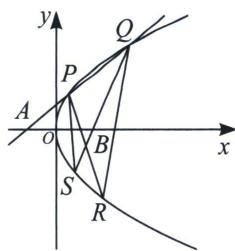

> [!faq]- 《圆锥曲线专题(上册)》例题解析
>
> > [!success]- **【答案】** 详见解析
>
> > [!note]- **【解析】**
> > 解析 (1) 直线 $MD$ 垂直于 $x$ 轴时, $D(p, 0)$ , 可得 $M$ 的横坐标为 $p$ , 又因为 $|MF| = 3$ , 由抛物线的性质可得 $p + \frac{p}{2} = 3$ , 解得 $p = 2$ , 所以抛物线的方程为: $y^{2} = 4x$ ;
> >
> > 
> >
> > (2)证明：由题意知直线 l 的斜率存在且不为 0，设 $P(x_{1}, y_{1})$ ， $Q(x_{2}, y_{2})$ ， $R(x_{3}, y_{3})$ ， $S(x_{4}, y_{4})$ ，则直线 l 的方程为 $(y_{1} + y_{2})y = 4x + y_{1}y_{2}$ （请自证），由于过点 A(-1, 0)，所以 $y_{1}y_{2} = 4$ ，
> >
> > 同理， $PR:(y_{1}+y_{3})y=4x+y_{1}y_{3}$ ，QS: $(y_{2}+y_{4})y=4x+y_{2}y_{4}$ ，由于都过点 $B(1,-1)$ ，所以 $y_{1}y_{3}+y_{1}+y_{3}+4=0$ ， $y_{2}y_{4}+y_{2}+y_{4}+4=0$ ，即 $y_{3}=-1-\frac{3}{y_{1}+1}$ ， $y_{4}=-1-\frac{3}{y_{2}+1}$ ，
> >
> > 所以 $k_{QR} + k_{PS} = \frac{y_2 - y_3}{x_2 - x_3} +\frac{y_1 - y_4}{x_1 - x_4} = \frac{4}{y_2 + y_3} +\frac{4}{y_1 + y_4} = \frac{4}{y_2 - \frac{4 + y_1}{y_1 + 1}} +\frac{4}{y_1 - \frac{4 + y_2}{y_2 + 1}} = \frac{4(y_1 + 1)}{y_1y_2 + y_2 - 4 - y_1} +$ $\frac{4(y_2 + 1)}{y_1y_2 + y_1 - 4 - y_2} = \frac{4(y_1 + 1)}{y_2 - y_1} +\frac{4(y_2 + 1)}{y_1 - y_2} = -4,$
> >
> > 即证得 $k_{QR} + k_{PS}$ 为定值.
