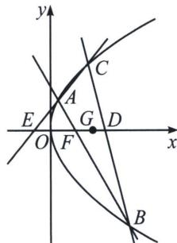

> [!faq]- 《圆锥曲线专题(上册)》例题解析
>
> > [!success]- **【答案】** 详见解析
>
> > [!note]- **【解析】**
> > 解析 (1)因为直线 $AB$ 通过抛物线 $\Gamma$ 的焦点 $F$ , 所以线段 $AB$ 为抛物线 $\Gamma$ 的焦点弦, 设 $A(x_{1}, y_{1})$ , $B(x_{2}, y_{2})$ , 线段 $AB$ 的中点 $M(x_{0}, y_{0})$ , 由抛物线的定义可得 $|AB| = x_{1} + x_{2} + \frac{m}{2} = 2x_{0} + \frac{m}{2}$ , 由平面几何的性质得当且仅当 $AB \perp x$ 轴时, $|AB|$ 取得最小值为 $m$ , 所以 $m = 4$ , 所以抛物线 $\Gamma$ 的标准方程为 $y^{2} = 4x$ ;
> >
> > (2)依题知直线 AB 的倾斜角不为 0，如图，设 $A(x_{1}, y_{1})$ ， $B(x_{2}, y_{2})$ ， $C(x_{3}, y_{3})$ ，
> >
> > 
> >
> > 则直线 AB 的方程为 $(y_{1}+y_{2})y=4x+y_{1}y_{2}$ （请自证），由于过点 $F(1,0)$ ，所以 $y_{1}y_{2}=-4$ ，同理，AC: $(y_{1}+y_{3})y=4x+y_{1}y_{3}$ ，由于过点 $E(e,0)$ ，所以 $y_{1}y_{3}=-4e$ ，即 $y_{1}=-\frac{4e}{y_{3}}$ ，BC: $(y_{2}+y_{3})y=4x+y_{2}y_{3}$ ，由于过点 $D(d,0)$ ，所以 $y_{2}y_{3}=-4d$ ，即 $y_{2}=-\frac{4d}{y_{3}}$ ，由重心定理可知： $y_{1}+y_{2}+y_{3}=0$ ，则 $y_{1}+y_{2}=-y_{3}$ ，即 $y_{3}^{2}=4(d+e)$ ①，
> >
> > $x_{1} + x_{2} + x_{3} = \frac{y_{1}^{2}}{4} +\frac{y_{2}^{2}}{4} +\frac{y_{3}^{2}}{4} = 3g$ ，即 $y_{1}^{2} + y_{2}^{2} = (y_{1} + y_{2})^{2} - 2y_{1}y_{2} = y_{3}^{2} + 8 = 12g - y_{3}^{2},y_{3}^{2} = 6g - 4②$
> >
> > 综合①②， $4(d+e)=6g-4$ ，所以 $\frac{3}{2}g-d-e$ 为定值1.
