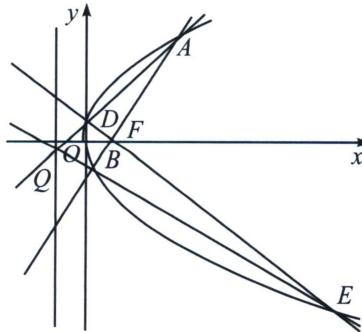

<!-- question-source:start -->
例13 (2024·保定二模)已知抛物线 C: $y^{2}=2px(p>0)$ 的焦点为 F，过 F 作互相垂直的直线 $l_{1}$ ， $l_{2}$ ，分别与 C 交于 A, B 和 D, E 两点 (A, D 在第一象限), 当直线 $l_{1}$ 的倾斜角等于 $45^{\circ}$ 时, 四边形 ADBE 的面积为 32.

(1)求 C 的方程;

(2)设直线 ${AD}$ 与 ${BE}$ 交于点 $Q$ ,证明：点 $Q$ 在定直线上.

(1)当直线 $l_{1}$ 的倾斜角等于 $45^{\circ}$ 时，直线 $l_{2}$ 的倾斜角等于 $135^{\circ}$ ，此时直线 $AB$ 的方程为 $y = x - \frac{p}{2}$ ，由抛物线的对称性得 $|AB| = |DE|$ ，所以 $S_{ADBE} = \frac{1}{2}|AB||DE| = 32$ ，解得 $|AB| = 8$ ，联立 $\left\{ \begin{array}{l} y = x - \frac{p}{2} \\ y^{2} = 2px \end{array} \right.$ ，消去 $y$ 并整理得 $x^{2} - 3px + \frac{p^{2}}{4} = 0$ ，此时 $\triangle = 8p^{2} > 0$ ，由韦达定理得 $x_{A} + x_{B} = 3p$ ，又 $|AB| = x_{A} + x_{B} + p = 4p = 8$ ，解得 $p = 2$ ，则 $C$ 的方程为 $y^{2} = 4x$ ；

(2)证明：由
(1)知 $F(1,0)$ ， $A(x_{1},y_{1})$ ， $B(x_{2},y_{2})$ ，得 $k_{AB}=\frac{y_{2}-y_{1}}{\frac{y_{2}^{2}}{4}-\frac{y_{1}^{2}}{4}}=\frac{4}{y_{1}+y_{2}}$ ，直线 AB 的方程为 $y=\frac{4}{y_{1}+y_{2}}\left(x-\frac{y_{1}^{2}}{4}\right)+y_{1}$ ，即 $4x-(y_{1}+y_{2})y+y_{1}y_{2}=0$ ，又直线 AB 过点 $F(1,0)$ ，所以 $y_{1}y_{2}=-4$ ，同理，设 $D(x_{3},y_{3})$ ， $E(x_{4},y_{4})$ ， $4x-(y_{3}+y_{4})y+y_{3}y_{4}=0$ ，又直线 DE 过点 $F(1,0)$ ，所以 $y_{3}y_{4}=-4$ ，

直线 AD 的方程为 $4x-(y_{1}+y_{3})y+y_{1}y_{3}=0①$ ，直线 BE 的方程为 $4x-(y_{2}+y_{4})y+y_{2}y_{4}=0②$ ，

直线 AD 的方程为 $4x-(y_{1}+y_{3})y+y_{1}y_{3}=0$ ，转化为 $4x-\left(\frac{-4}{y_{2}}+\frac{-4}{y_{4}}\right)y+\frac{16}{y_{2}y_{4}}=0$ ，

即 $(y_{2}+y_{4})y=-y_{2}y_{4}x-4$ ，和直线BE的方程 $(y_{2}+y_{4})y=4x+y_{2}y_{4}$ ，联立得：x=-1.

所以点 Q 的横坐标为 -1，即直线 AD 与 BE 的交点在定直线 x = -1 上.

注意 本题以 $F$ 为极点，点 $Q$ 在其对应极线上，这个属于完全四边形对角线形成最基础的极点极线定理，在圆锥曲线考题中经常出现，也是必须能解答的题型.
<!-- question-source:end -->

![[高中/总复习/专题/2026版高中《mst老唐说题》圆锥曲线专题（数学）/上册/第06章_联立之同构方程/第一节_抛物线两点联立式方程/三_两点联立式下的彭塞列闭合/例题/answers/Q00048607A1.md]]
