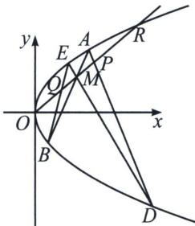

<!-- question-source:start -->
例14（2024·哈师大附中、东北师大附中、辽宁省实验中学三模）如图抛物线 $C: y^{2} = x$ ，过 $M(2, 1)$ 有两条直线 $l_{1}, l_{2}, l_{1}$ 与抛物线交于 $A, B, l_{2}$ 与抛物线交于 $D, E$ .

(1)若 $l_{1}$ 斜率为1，求 $\vert AB\vert$ ；

(2)是否存在抛物线 C 上定点 N，使得 $\overrightarrow{NA} \cdot \overrightarrow{NB} = 0$ ，若存在，求出 N 点坐标并证明，若不存在，请说明理由；

(3) 直线 $y=\frac{1}{2}x$ 与直线 AD，BE 相交于 P，Q 两点，证明：M 为 PQ 中点.

(1)由题意, 直线 $AB$ 方程为 $y - 1 = x - 2$ , 即 $y = x - 1$ ,

联立方程组 $\left\{\begin{aligned}y&=x-1\\ y^{2}&=x\end{aligned}\right.$ ，可得 $y^{2}-y-1=0$ ，可得 $\Delta=5>0$ 且， $y_{1}+y_{2}=1$ ， $y_{1}y_{2}=-1$ ，

所以 $|AB| = \sqrt{1 + 1^2} \cdot \sqrt{(y_1 - y_2)^2} = \sqrt{2} \cdot \sqrt{(y_1 + y_2)^2 - 4y_1y_2} = \sqrt{10}$ ;

(2)设 $A(x_{1},y_{1})$ ， $B(x_{2},y_{2})$ ，假设存在 $N(x_0,y_0)$ ，由题意， $k_{AB} = \frac{y_2 - y_1}{x_2 - x_1} = \frac{y_2 - y_1}{y_2^2 - y_1^2}$ ，得到 $k_{AB} = \frac{1}{y_1 + y_2}$ ，故直线 $AB$ 方程为： $y - y_{1} = \frac{1}{y_{1} + y_{2}} (x - y_{1}^{2})$ ，化简可得： $(y_{1} + y_{2})y = x + y_{1}y_{2}$ ①，又因为点 $M(2,$ 1)在 $AB$ 上，所以 $y_{1} + y_{2} = 2 + y_{1}y_{2}$ ②

同理 $AN: (y_0 + y_1)y = x + y_0y_1$ ， $BN: (y_0 + y_2)y = x + y_0y_2$ ，由于 $AN \perp BN$ ，故 $\frac{1}{(y_0 + y_1)} \cdot \frac{1}{(y_0 + y_2)} = -1$ ， $y_0^2 + (y_1 + y_2)y_0 + y_1y_2 + 1 = 0$ ，代入②得： $y_0^2 + (y_1y_2 + 2)y_0 + y_1y_2 + 1 = (y_0 + y_1y_2 + 1)(y_0 + 1) = 0$ 所以 $y_0 = -1$ ，故存在定点 $N(1, -1)$ 满足题意.

证明：
(3)设 $A(a^{2}, a)$ ， $B(b^{2}, b)$ ， $E(c^{2}, c)$ ， $D(d^{2}, d)$ ，

则 $l_{AB}:(a+b)y=x+ab$ 过 M(2,1)，所以 $a+b=2+ab$ ，所以 $b=\frac{a-2}{a-1}$

$l_{ED}:(c+d)y=x+cd$ 过 M(2,1)，所以 $c+d=2+cd$ ，所以 $c=\frac{d-2}{d-1}$

$l_{AD}:(a+d)y=x+ad$ ，联立方程组 $\left\{\begin{aligned}(a+d)y&=x+ad\\ y&=\frac{1}{2}x\end{aligned}\right.$ ，可得 $x_{p}=\frac{2ad}{a+d-2}$ ，同理 $x_{Q}=\frac{2bc}{b+c-2}$

$$
x _ {P} + x _ {Q} = \frac {2 a d}{a + d - 2} + \frac {2 b c}{b + c - 2} = \frac {2 a d}{a + d - 2} + \frac {2 \left(\frac {a - 2}{a - 1}\right) \left(\frac {d - 2}{d - 1}\right)}{\frac {a - 2}{a - 1} + \frac {d - 2}{d - 1} - 2} = \frac {4 a + 4 d - 8}{a + d - 2} = 4 = 2 x _ {M},
$$

注意 本题背景来自蝴蝶定理，即直线 $y = \frac{1}{2} x$ 与抛物线交于点 $O(0,0)$ 和 $R(4,2)$ ，在抛物线的内接四边形ABDE中，由于 $M$ 为OR中点，则 $M$ 为PQ中点。关于更多详细蝴蝶定理的内容，我们会在本书第十一章详细解读。
<!-- question-source:end -->

![[高中/总复习/专题/2026版高中《mst老唐说题》圆锥曲线专题（数学）/上册/第06章_联立之同构方程/第一节_抛物线两点联立式方程/三_两点联立式下的彭塞列闭合/例题/answers/Q00048608A1.md]]
