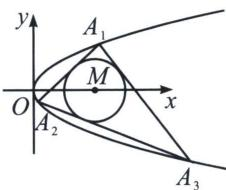

<!-- question-source:start -->
例12 (2021·全国甲卷)抛物线 $C$ 的顶点为坐标原点 $O$ , 焦点在 $x$ 轴上, 直线 $l: x = 1$ 交 $C$ 于 $P 、 Q$ 两点, 且 $OP \perp OQ$ , 已知点 $M(2,0)$ , 且圆 $M$ 与 $l$ 相切.

(1)求 C，圆 M 的方程；

(2)设 $A_{1}$ 、 $A_{2}$ 、 $A_{3}$ 是 $C$ 上的三个点，直线 $A_{1}A_{2}$ ， $A_{1}A_{3}$ 均与圆 $M$ 相切，判断直线 $A_{2}A_{3}$ 与圆 $M$ 的位置关系，并说明理由.

(1)因为 $x = 1$ 与抛物线有两个不同的交点, 故可设抛物线 $C$ 的方程为: $y^{2} = 2px (p > 0)$ , 令 $x = 1$ , 则 $y = \pm \sqrt{2p}$ , 根据抛物线的对称性, 不妨设 $P$ 在 $x$ 轴上方, $Q$ 在 $x$ 轴下方, 故 $P(1, \sqrt{2p})$ , $Q(1, -\sqrt{2p})$ , 因为 $OP \perp OQ$ , 故 $1 + \sqrt{2p} \times (-\sqrt{2p}) = 0 \Rightarrow p = \frac{1}{2}$ , 抛物线 $C$ 的方程为: $y^{2} = x$ , 因为 $\odot M$ 与 $l$ 相切, 所以其半径为 1 , 所以 $\odot M: (x - 2)^{2} + y^{2} = 1$ .

(2)设 $A_{1}(x_{0},y_{0})$ ， $A_{2}(x_{1},y_{1})$ ， $A_{3}(x_{2},y_{2})$ ，由于 $k_{A_1A_2} = \frac{y_1 - y_0}{x_1 - x_0} = \frac{y_1 - y_0}{\frac{1}{2p}(y_1^2 -y_0^2)} = \frac{2p}{y_1 + y_0}$

所以 $A_{1}A_{2}$ 方程： $y-y_{1}=\frac{2p}{y_{1}+y_{0}}(x-x_{1})$ ，即 $A_{1}A_{2}: x-(y_{0}+y_{1})y+y_{0}y_{1}=0$ ，

由 $A_{1}A_{2}$ 与圆相切得： $d_{M - A_1A_2} = \frac{|2 + y_0y_1|}{\sqrt{1 + (y_0 + y_1)^2}} = 1$ ，即： $(y_0^2 -1)x_1 + 2y_0y_1 + 3 - y_0^2 = 0①$

同理直线 $A_{1}A_{3}$ 与圆 M 相切，故： $(y_{0}^{2}-1)x_{2}+2y_{0}y_{2}+3-y_{0}^{2}=0②$

由①②可得， $A_{2}$ 、 $A_{3}$ 均满足同构方程 $(y_{0}^{2}-1)x+2y_{0}y+3-y_{0}^{2}=0$ ，根据两点确定一直线，

所以 $A_{2}A_{3}$ 直线方程： $(y_{0}^{2}-1)x+2y_{0}y+3-y_{0}^{2}=0$ 。所以 $d_{M-A_{2}A_{3}}=\frac{|2(y_{0}^{2}-1)+3-y_{0}^{2}|}{\sqrt{(y_{0}^{2}-1)^{2}+(2y_{0})^{2}}}=\frac{y_{0}^{2}+1}{\sqrt{(y_{0}^{2}+1)^{2}}}=$

1. 所以圆 $M$ 与 $A_{2}A_{3}$ 相切.

注意 本题有一个背景，就是彭塞列闭合定理。 $A_{1}$ 、 $A_{2}$ 、 $A_{3}$ 是 C 上的三个点，这三个点是完全等价的，可轮换的，同构方程就必须要有等价性，可替换性，直线 $A_{1}A_{2}$ ， $A_{1}A_{3}$ ， $A_{2}A_{3}$ 三者同构，所以第三条边 $A_{2}A_{3}$ 也一定与圆相切。前面的题目 PA、PB 虽然与圆 C 相切，但是 P 是定点，是不可以参与轮换的，那么 PA，PB 能同构，因为同时经过点 P，且 A、B 两点在抛物线上，但是不能与 AB 进行同构。

## 四、两点联立式下的极点极线证明

极点极线知识点不复杂，但是落实在解答题的书写当中，就成了一个难题，往往需要联立三四次，但是有了两点联立式的同构属性，一切化繁为简.
<!-- question-source:end -->

![[高中/总复习/专题/2026版高中《mst老唐说题》圆锥曲线专题（数学）/上册/第06章_联立之同构方程/第一节_抛物线两点联立式方程/三_两点联立式下的彭塞列闭合/例题/answers/Q00048942A1.md]]
