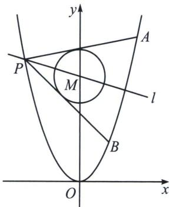

<!-- question-source:start -->
例10 (2011·浙江理)已知抛物线 $C_1: x^2 = y$ ，圆 $C_2: x^2 + (y - 4)^2 = 1$ 的圆心为 $M$ ， $P$ 是 $C_1$ 上一点（异于原点），过 $P$ 作圆 $C_2$ 的两条切线，交 $C_1$ 于 $A$ 、 $B$ 两点， $MP \perp AB$ 。求 $PM$ 的方程。

<!-- question-source:end -->

![[高中/总复习/专题/2026版高中《mst老唐说题》圆锥曲线专题（数学）/上册/第06章_联立之同构方程/第一节_抛物线两点联立式方程/二_两点联立式下的双切圆/例题/answers/Q00048957A1.md]]
