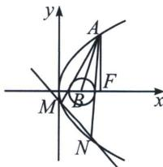

<!-- question-source:start -->
例9 (2024·浙江模拟)如图, 已知点 $A$ 是抛物线 $y^{2} = 2px (p > 0)$ 在第一象限上的点, $F$ 为抛物线的焦点, 且 $AF$ 垂直于 $x$ 轴. 过 $A$ 作圆 $B: (x - 1)^{2} + y^{2} = r^{2} (0 < r < 1)$ 的两条切线, 与抛物线在第四象限分别交于 $M$ , $N$ 两点, 且直线 $AB$ 的斜率为 4.

(1)求抛物线的方程及A点坐标；

(2)问：直线 $MN$ 是否经过定点？若是，求出该定点坐标，若不是，请说明理由.

<!-- question-source:end -->

![[高中/总复习/专题/2026版高中《mst老唐说题》圆锥曲线专题（数学）/上册/第06章_联立之同构方程/第一节_抛物线两点联立式方程/二_两点联立式下的双切圆/例题/answers/Q00053013A1.md]]
