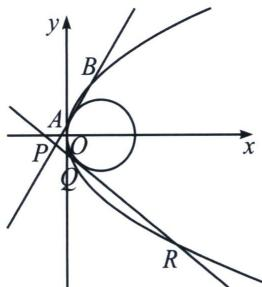

> [!faq]- 《圆锥曲线专题(上册)》例题解析
>
> > [!success]- **【答案】** 详见解析
>
> > [!note]- **【解析】**
> > 解析 (1)由题设得 $p = 2$ , 所以抛物线 $C$ 的方程为 $y^{2} = 4x$ , 因此, 抛物线的焦点为 $F(1,0)$ , 即圆 $M$ 的圆心为 $M(1,0)$ , 由圆 $M$ 与 $y$ 轴相切, 所以圆 $M$ 半径为 1 , 所以圆 $M$ 的方程为 $(x - 1)^{2} + y^{2} = 1$ ;
> >
> > 
> >
> > (2)证明：由于 $P(x_{0}, y_{0})(x_{0} \neq 2)$ ，每条切线都与抛物线有两个不同的交点，则 $x_{0} \neq 0$ ，
> >
> > \( AB:(y\_{1}+y\_{2})y=4x+y\_{1}y\_{2},QR:(y\_{3}+y\_{4})y=4x+y\_{3}y\_{4} \) （请自证），所以 \( \left\{\begin{aligned}(y\_{1}+y\_{2})y\_{0}&=y\_{1}y\_{2}+4x\_{0}\\ (y\_{3}+y\_{4})y\_{0}&=y\_{3}y\_{4}+4x\_{0}\end{aligned}\right. \) 
> > 依题意得 \( \frac{|y\_{1}y\_{2}+4|}{\sqrt{(y\_{1}+y\_{2})^{2}+16}}=\frac{|y\_{3}y\_{4}+4|}{\sqrt{(y\_{3}+y\_{4})^{2}+16}}=1 \) ，所以 \( \left\{\begin{aligned}(y\_{1}y\_{2}+4)^{2}&=(y\_{1}+y\_{2})^{2}+16\\(y\_{3}y\_{4}+4)^{2}&=(y\_{3}+y\_{4})^{2}+16\end{aligned}\right. \) 均为同构方程，故我们只需要计算 \( (y\_{1}y\_{2}+4)^{2}=(y\_{1}+y\_{2})^{2}+16 \) ，即 \( y\_{1}^{2}y\_{2}^{2}\left(1-\frac{1}{y\_{0}^{2}}\right)+8y\_{1}y\_{2}\left(1-\frac{x\_{0}}{y\_{0}^{2}}\right)-\frac{16x\_{0}^{2}}{y\_{0}^{2}}=0 \) ，同理，
> >  \( y\_{3}^{2}y\_{4}^{2}\left(1-\frac{1}{y\_{0}^{2}}\right)+8y\_{3}y\_{4}\left(1-\frac{x\_{0}}{y\_{0}^{2}}\right)-\frac{16x\_{0}^{2}}{y\_{0}^{2}}=0 \) ，所以根据同构方程思想， \( y\_{1}y\_{2}y\_{3}y\_{4}=\frac{-\frac{16x\_{0}^{2}}{y\_{0}^{2}}}{1-\frac{1}{y\_{0}^{2}}}=16 \) ，
> > 即  \( x\_{0}^{2}+y\_{0}^{2}=1 \) ，所以点 P 在圆  \( x^{2}+y^{2}=1 \) 。
