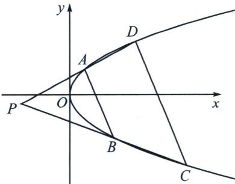
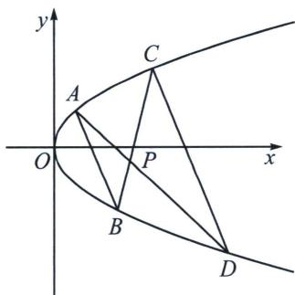

## 五、两点联立式下的平行弦同构

平行就意味着分线段成比例相等，这就是等位的理解，数学中对等位的语言就是可以同构，我们先来进行数学建模.

如图所示，抛物线 $y^{2}=2px$ 上存在 $A(x_{1},y_{1})$ ， $B(x_{2},y_{2})$ ， $C(x_{3},y_{3})$ ， $D(x_{4},y_{4})$ 四点，AD 与 BC 交于 $P(x_{0},y_{0})$ ，且 $AB\parallel CD$ ，令 $\overrightarrow{AP}=\lambda\overrightarrow{PD}$ ， $\overrightarrow{BP}=\lambda\overrightarrow{PC}$ ，则

$$
k _ {A B} = k _ {C D} = \frac {p}{y _ {0}};
(2) y _ {1} + y _ {2} = y _ {3} + y _ {4} = 2 y _ {0};
(3) y _ {1} y _ {2} = (1 + \lambda) y _ {0} ^ {2} - 2 \lambda p x _ {0}, y _ {3} y _ {4} = (1 + \frac {1}{\lambda}) y _ {0} ^ {2} - \frac {2 p x _ {0}}{\lambda};
$$

证明： $k_{AB}=\frac{y_{2}-y_{1}}{x_{2}-x_{1}}=\frac{y_{2}-y_{1}}{\frac{y_{2}^{2}}{2p}-\frac{y_{1}^{2}}{2p}}$ ，得到 $k_{AB}=\frac{2p}{y_{1}+y_{2}}$ ，故直线 AB 方程为： $y-y_{1}=\frac{2p}{y_{1}+y_{2}}(x-\frac{y_{1}^{2}}{2p})$ ，化简

可得： $(y_{1} + y_{2})y = 2px + y_{1}y_{2}$ ，同理，直线 $CD$ 方程为： $(y_{3} + y_{4})y = 2px + y_{3}y_{4}$ ，由于 $AB \parallel CD$

故 $k_{AB} = k_{CD} = \frac{2p}{y_1 + y_2} = \frac{2p}{y_3 + y_4}$ ①，由于 $\left\{ \begin{array}{l} \overrightarrow{AP} = \lambda \overrightarrow{PD} \\ \overrightarrow{BP} = \lambda \overrightarrow{PC} \end{array} \right. \Rightarrow y_0 = \frac{y_1 + \lambda y_4}{1 + \lambda} = \frac{y_2 + \lambda y_3}{1 + \lambda}$ ，即 $\left\{ \begin{array}{l} y_1 = (1 + \lambda)y_0 - \lambda y_4 \\ y_2 = (1 + \lambda)y_0 - \lambda y_3 \end{array} \right.$ ②，

由①②得： $y_{1}+y_{2}=2(1+\lambda)y_{0}-\lambda(y_{3}+y_{4})=y_{3}+y_{4}$ ，即 $y_{1}+y_{2}=y_{3}+y_{4}=2y_{0}$ ，且 $k_{AB}=k_{CD}=\frac{p}{y_{0}}$ ;

$$
A D: \left(y _ {1} + y _ {4}\right) y = 2 p x + y _ {1} y _ {4}
$$

$$
P \left(x _ {0}, y _ {0}\right)
$$

$$
\left(y _ {1} + y _ {4}\right) y _ {0} = 2 p x _ {0} + y _ {1} y _ {4}
$$

将②式代入得： $\left\{\begin{aligned}y_{1}^{2}-2y_{0}y_{1}+(1+\lambda)y_{0}^{2}-2\lambda p x_{0}&=0\\ y_{4}^{2}-2y_{0}y_{4}+(1+\frac{1}{\lambda})y_{0}^{2}-\frac{2p x_{0}}{\lambda}&=0\end{aligned}\right.$

同理 $BC: (y_{2} + y_{3})y = 2px + y_{2}y_{3}$ ，将 $P(x_0, y_0)$ 和②式代入得： $\left\{ \begin{array}{l} y_2^2 - 2y_0y_2 + (1 + \lambda)y_0^2 - 2\lambda px_0 = 0 \\ y_3^2 - 2y_0y_3 + (1 + \frac{1}{\lambda})y_0^2 - \frac{2px_0}{\lambda} = 0 \end{array} \right.$ ；

所以 $y_{1}$ 、 $y_{2}$ 均在同构方程 $y^{2}-2y_{0}y+(1+\lambda)y_{0}^{2}-2\lambda px_{0}=0$ 上，所以 $y_{1}y_{2}=(1+\lambda)y_{0}^{2}-2\lambda px_{0}$ ;

所以 $y_{3}$ 、 $y_{4}$ 均在同构方程 $y^{2} - 2y_{0}y + (1 + \frac{1}{\lambda})y_{0}^{2} - \frac{2px_{0}}{\lambda} = 0$ 上，所以 $y_{3}y_{4} = (1 + \frac{1}{\lambda})y_{0}^{2} - \frac{2px_{0}}{\lambda};$

注意：我们只需要用两点式求出两相交直线的方程，即可得出 $y_{1} + y_{2} = y_{3} + y_{4} = 2y_{0}$ 和 $y_{1}y_{2} = (1 + \lambda)y_{0}^{2} - 2\lambda px_{0}$ ， $y_{3}y_{4} = (1 + \frac{1}{\lambda})y_{0}^{2} - \frac{2px_{0}}{\lambda}$ ，这两个式子好记忆，用 $y_{0}^{2} - 2px_{0}$ 左边乘以 $(1 + \lambda)$ ，右边乘以 $\lambda$ ，或者左边乘以 $(1 + \frac{1}{\lambda})$ ，右边乘以 $\frac{1}{\lambda}$ ，如果不需要求两个平行直线的斜率，则两平行线的方程都是多余的，我们只是在建模时候给大家解释清楚.

我们同样可以得到抛物线 $x^{2} = 2py$ 上存在 $A(x_{1},y_{1}),B(x_{2},y_{2}),C(x_{3},y_{3}),D(x_{4},y_{4})$ 四点， $AD$ 与 $BC$ 交于 $P(x_0,y_0)$ ，且 $AB / / CD$ ，令 $\overrightarrow{AP} = \lambda \overrightarrow{PD}$ ， $\overrightarrow{BP} = \lambda \overrightarrow{PC}$ ，则

$$
(1) k _ {A B} = k _ {C D} = \frac {x _ {0}}{p};
(2) x _ {1} + x _ {2} = x _ {3} + x _ {4} = 2 x _ {0};
(3) x _ {1} x _ {2} = (1 + \lambda) x _ {0} ^ {2} - 2 \lambda p y _ {0}, x _ {3} x _ {4} = (1 + \frac {1}{\lambda}) x _ {0} ^ {2} - \frac {2 p y _ {0}}{\lambda};
$$

![[高中/总复习/专题/2026版高中《mst老唐说题》圆锥曲线专题（数学）/上册/第06章_联立之同构方程/第一节_抛物线两点联立式方程/五_两点联立式下的平行弦同构/例题/Q00048609.md]]
![[高中/总复习/专题/2026版高中《mst老唐说题》圆锥曲线专题（数学）/上册/第06章_联立之同构方程/第一节_抛物线两点联立式方程/五_两点联立式下的平行弦同构/例题/Q00048610.md]]
![[高中/总复习/专题/2026版高中《mst老唐说题》圆锥曲线专题（数学）/上册/第06章_联立之同构方程/第一节_抛物线两点联立式方程/五_两点联立式下的平行弦同构/例题/Q00048611.md]]
