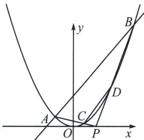

<!-- question-source:start -->
例14 (2024·浙江模拟)如图所示, 已知抛物线 $x^{2} = 4y$ 的焦点为 $F$ , 过 $F$ 的直线交抛物线于 $A$ , $B$ 两
B 老唐说题

点，A 在 y 轴左侧且 AB 的斜率大于 0.

(1)当直线 $AB$ 的斜率为 1 时, 求弦长 $|AB|$ 的长度;

(2) 点 $P(x_0, 0)$ 在 $x$ 轴正半轴上，连接 $PA, PB$ 分别交抛物线于 $C, D$ 若 $AB \parallel CD$ 且 $|AB| = 3|CD|$ ，求 $x_0$ .

(1)因为点 $F$ 坐标为 $(0, 1)$ , 且直线 $AB$ 的斜率为 1 , 故直线 $AB: x - y + 1 = 0$ ,

$\left\{ \begin{array}{l} x^{2} = 4y \\ x - y + 1 = 0 \end{array} \right.$ 得 $x^{2} - 4x - 4 = 0$ ， $|AB| = \sqrt{2}\sqrt{4^2 + 4\times 4} = 8.$

(2)设 $A(x_{1},y_{1}),B(x_{2},y_{2}),C(x_{3},y_{3}),D(x_{4},y_{4})$ ，因为 $AB / / CD,|AB| = 3|CD|$ ，所以 $\overrightarrow{AP} = -$ $3\overrightarrow{PC},\overrightarrow{BP} = -3\overrightarrow{PD}$ ，根据定比分点公式： $\left\{ \begin{array}{l}x_0 = \frac{x_1 - 3x_3}{-2}\\ 0 = y_1 - 3y_3 \end{array} \right.$ ①， $\left\{ \begin{array}{l}x_0 = \frac{x_2 - 3x_4}{-2}\\ 0 = y_2 - 3y_4 \end{array} \right.$ ②，

设直线 AB 方程为： $y - y_{1} = \frac{y_{2} - y_{1}}{x_{2} - x_{1}} (x - x_{1})$ ，由于 $\frac{y_{2} - y_{1}}{x_{2} - x_{1}} = \frac{\frac{x_{2}^{2}}{4} - \frac{x_{1}^{2}}{4}}{x_{2} - x_{1}} = \frac{x_{1} + x_{2}}{4}$ ，化简得： $(x_{1} + x_{2})x = 4y + x_{1}x_{2}$ ③，

同理，直线 $AC$ 方程为： $(x_{1} + x_{3})x = 4y + x_{1}x_{3}$ ，代入 $P(x_0,0)$ 得： $(x_{1} + x_{3})x_{0} = x_{1}x_{3}$ ，再将①代入，可得： $x_{1}^{2} - 2x_{0}x_{1} - 2x_{0}^{2} = 0$ ，同理，直线 $BD$ 方程可得出 $x_{2}^{2} - 2x_{0}x_{2} - 2x_{0}^{2} = 0$ ，所以 $x_{1},x_{2}$ 是同构方程 $x^{2}-$ $2x_{0}x - 2x_{0}^{2} = 0$ 的两根，所以 $x_{1}x_{2} = -2x_{0}^{2}$ .由于 $AB$ 过焦点，根据③可得： $x_{1}x_{2} = -4$ ，解得 $x_0 = \sqrt{2}$ 故 $x_0$ $= \sqrt{2}$
<!-- question-source:end -->

![[高中/总复习/专题/2026版高中《mst老唐说题》圆锥曲线专题（数学）/上册/第06章_联立之同构方程/第一节_抛物线两点联立式方程/五_两点联立式下的平行弦同构/例题/answers/Q00048609A1.md]]
