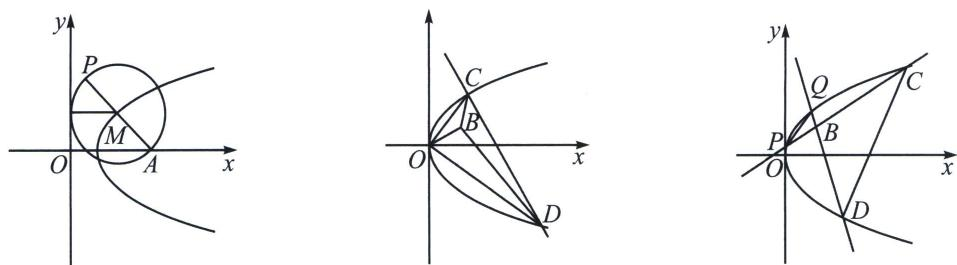

<!-- question-source:start -->
例15（湖北省部分学校（圆创）2025届高三下学期考前压轴卷T18)平面直角坐标系中，点 $A(2,0)$ ， $P$ 为动点，以 $PA$ 为直径的圆与 $y$ 轴相切，动点 $P$ 的轨迹记为 $E$ .

(1)求 $E$ 的方程;

(2)已知点 $B(1, 1)$ , 不经过点 $B$ 的直线 $l$ 与 $E$ 相交于 $C$ , $D$ 两点.

①若 B 为 $\triangle OCD$ 的垂心，求 l 的方程；

②连结 $CB, DB$ 分别交 $E$ 于点 $P, Q$ , 若 $PQ \parallel CD$ , 求 $l$ 的斜率.

(1) 设 $P(x, y)$ , $PA$ 中点为 $M$ , 因为 $A(2, 0)$ , 所以 $M(\frac{x+2}{2}, \frac{y}{2})$ , 由题意知 $\sqrt{(\frac{x+2}{2}-2)^2+(\frac{y}{2})^2}=\frac{x+2}{2}$ , 化简可得 $y^2=8x$ , 所以动点 $P$ 的轨迹记 $E$ 为 $y^2=8x$ .

(2)①设 $C(x_{1}, y_{1}), D(x_{2}, y_{2})$ , 已知 $B(1, 1)$ , 因为 $B$ 为 $\triangle OCD$ 的垂心, 所以有 $\overrightarrow{BC} \cdot \overrightarrow{BO} = \overrightarrow{BC} \cdot \overrightarrow{BD} = \overrightarrow{BD} \cdot \overrightarrow{BO}$ , $\overrightarrow{BC} = (x_{1}-1, y_{1}-1)$ , $\overrightarrow{BD} = (x_{2}-1, y_{2}-1)$ , $\overrightarrow{BO} = (-1, -1)$ , 由 $\overrightarrow{BC} \cdot \overrightarrow{BO} = \overrightarrow{BD} \cdot \overrightarrow{BO}$ 可得 $-(x_{1}-1)-(y_{1}-1)=- (x_{2}-1)-(y_{2}-1)$ , 化简得 $x_{1}-x_{2}=y_{2}-y_{1}$ , 即直线 $CD$ 斜率为 $-1$ , 设直线 $CD: (y_{1}+y_{2})y=8x+y_{1}y_{2}$ (自证), $k=\frac{8}{y_{1}+y_{2}}=-1 \Rightarrow y_{1}+y_{2}=-8$ , 由 $\overrightarrow{BC} \cdot \overrightarrow{BO} = \overrightarrow{BC} \cdot \overrightarrow{BD}$ 可得 $(x_{1}-1)(x_{2}-1)+(y_{1}-1)(y_{2}-1)=- (x_{1}-1)-(y_{1}-1)$ , 同理 $(x_{1}-1)(x_{2}-1)+(y_{1}-1)(y_{2}-1)=- (x_{2}-1)-(y_{2}-1)$ ,

$$
\left\{ \begin{array}{l} \frac {\left(y _ {1} y _ {2}\right) ^ {2}}{6 4} + y _ {1} y _ {2} = \frac {y _ {2} ^ {2}}{8} + y _ {2} \\ \frac {\left(y _ {1} y _ {2}\right) ^ {2}}{6 4} + y _ {1} y _ {2} = \frac {y _ {1} ^ {2}}{8} + y _ {1} \end{array} \Rightarrow \frac {\left(y _ {1} y _ {2}\right) ^ {2}}{3 2} + 2 y _ {1} y _ {2} = \frac {y _ {1} ^ {2} + y _ {2} ^ {2}}{8} + y _ {1} + y _ {2} \Rightarrow \frac {\left(y _ {1} y _ {2}\right) ^ {2}}{3 2} + \frac {9}{4} y _ {1} y _ {2} = 0, \right.
$$

所以 $y_{1}y_{2}=-72$ ，直线方程为 $y=-x+9$ .

② $C(x_{1},y_{1}),D(x_{2},y_{2}),P(x_{3},y_{3}),Q(x_{4},y_{4})$ ，由于 $PQ\parallel CD$ ，所以令 $\overrightarrow{CB}=\lambda\overrightarrow{BP},\overrightarrow{DB}=\lambda\overrightarrow{BQ}$ ， $B(1,1)$ ，则 $\left\{\begin{aligned}&1=\frac{y_{1}+\lambda y_{3}}{1+\lambda}\\ &1=\frac{y_{2}+\lambda y_{4}}{1+\lambda}\end{aligned}\right.$ ，即 $\left\{\begin{aligned}y_{1}&=(1+\lambda)-\lambda y_{3}\\ y_{2}&=(1+\lambda)-\lambda y_{4}\end{aligned}\right.$ ①，

由于 $\left\{\begin{aligned}PC:(y_{1}+y_{3})y=8x+y_{1}y_{3}\\ DQ:(y_{2}+y_{4})y=8x+y_{2}y_{4}\end{aligned}\right.$ 且过 $B(1,1)\Rightarrow\left\{\begin{aligned}y_{1}+y_{3}=8+y_{1}y_{3}\\ y_{2}+y_{4}=8+y_{2}y_{4}\end{aligned}\right.$ ②，

由①②得： $\left\{\begin{aligned}\lambda y_{3}^{2}-2\lambda y_{3}-7+\lambda=0\\ \lambda y_{4}^{2}-2\lambda y_{4}-7+\lambda=0\end{aligned}\right.$ ，所以 $y_{3}+y_{4}=\frac{2\lambda}{\lambda}=2$ ，所以 $k_{PQ}=\frac{2p}{y_{3}+y_{4}}=4$ ，所以l的斜率为4.
<!-- question-source:end -->

![[高中/总复习/专题/2026版高中《mst老唐说题》圆锥曲线专题（数学）/上册/第06章_联立之同构方程/第一节_抛物线两点联立式方程/五_两点联立式下的平行弦同构/例题/answers/Q00048610A1.md]]
