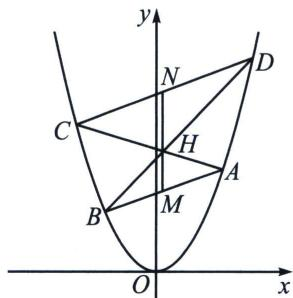

<!-- question-source:start -->
例16（合肥一中2025届高三最后一卷18题（陪跑课学员胡升辉、潘思宇提问））在直角坐标系 $xOy$ 中. 点 $P$ 到点 $F(0, \frac{1}{4})$ 的距离等于点 $P$ 到直线 $y = -\frac{1}{4}$ 的距离．记动点 $P$ 的轨迹为 $W$ .

(1)求 W 的方程;

(2)已知梯形 ABCD 的四个顶点都在曲线 W 上，其中 A、D 在第一象限(D 在 A 的上方). B、C 在第二象限，且 $AB \parallel CD$ ，线段 AC，BD 交于点 H，记 AB，CD 中点分别为 M、N.

(i) 求证: $\overrightarrow{MN} \parallel \overrightarrow{NH}$ ;

(ii) 若线段 $MN$ 长度为 3, 梯形 $ABCD$ 的面积为 9, 求线段 $CD$ 与 $AB$ 长度的比值.

(1)根据抛物线的定义可知, 动点 $P$ 的轨迹为抛物线, 其中 $F\left(0, \frac{1}{4}\right)$ 为焦点, 直线 $y = -\frac{1}{4}$ 为准线, 所以点 $P$ 的轨迹为曲线 $E$ 的方程为 $y = x^2$ .

(2)(i)证明: 由 $AB \parallel CD$ 可知, $\Delta ABH \sim \Delta CDH$ , 又因为 $D$ 在 $A$ 的上方, 则 $\frac{|HC|}{|HA|} = \frac{|HD|}{|HB|} = t (t > 1)$ , 所以 $\overrightarrow{HC} = -t \overrightarrow{HA}$ , $\overrightarrow{HD} = -t \overrightarrow{HB}$ , 由 $AB$ 中点为 $M$ , 可得 $\overrightarrow{HM} = \frac{\overrightarrow{HA} + \overrightarrow{HB}}{2}$ . 同理 $\overrightarrow{HN} = \frac{\overrightarrow{HC} + \overrightarrow{HD}}{2}$ , 又 $\overrightarrow{HN} = \frac{\overrightarrow{HC} + \overrightarrow{HD}}{2} = -t \frac{\overrightarrow{HA} + \overrightarrow{HB}}{2} = -t \overrightarrow{HM}$ , 所以: $\overrightarrow{MN} \parallel \overrightarrow{NH}$ .

（ii）设直线 $AB$ 的方程为： $(x_{1} + x_{2})x = y + x_{1}x_{2}$ ，直线 $CD$ 得方程为： $(x_{3} + x_{4})x = y + x_{3}x_{4}$ （过程自证）所以 $x_{M} = \frac{x_{1} + x_{2}}{2}$ ，同理， $x_{N} = \frac{x_{3} + x_{4}}{2}$ ，所以 $x_{M} = x_{N} = x_{0}$ ，则直线 $MN // y$ 轴，令 $H(x_{0}, y_{0})$ 由（i）可知， $\frac{|CD|}{|AB|} = \frac{|HN|}{|HM|} = t$ ，因为 $\frac{|CD|}{|AB|} = \frac{\sqrt{1 + k^{2}} |x_{C} - x_{D}|}{\sqrt{1 + k^{2}} |x_{A} - x_{B}|} = \frac{|x_{C} - x_{D}|}{|x_{A} - x_{B}|} = t$ ，所以 $x_{0} = \frac{x_{3} + tx_{1}}{1 + t} = \frac{x_{4} + tx_{2}}{1 + t}$ ，所以 $x_{3} = (1 + t)x_{0} - tx_{1}$ ， $x_{4} = (1 + t)x_{0} - tx_{2}$ ，代入 $\left\{ \begin{array}{l} AC: (x_{1} + x_{3})x_{0} = y_{0} + x_{1}x_{3} \\ BD: (x_{2} + x_{4})x_{0} = y_{0} + x_{2}x_{4} \end{array} \right.$ 得： $\left\{ \begin{array}{l} -2tx_1x_0 + (1 + t)x_0^2 = y_0 - tx_1^2 \\ -2tx_2x_0 + (1 + t)x_0^2 = y_0 - tx_2^2 \end{array} \right.$ ，两式均为 $tx^{2} - 2tx_{0}x + (1 + t)x_{0}^{2} - y_{0} = 0$ 同构方程，且 $AB: (x_{1} + x_{2})x_{0} = y_{M} + x_{1}x_{2}$ ，所以 $x_{1}x_{2} = 2x_{0}^{2} - y_{M} = \frac{(1 + t)x_{0}^{2} - y_{0}}{t}$ ，所以 $y_{0} = (1 - t)x_{0}^{2} + ty_{M} \Rightarrow y_{M} = \frac{y_{0} - x_{0}^{2}}{t} + x_{0}^{2}$ ①，又因为 $\frac{|HN|}{|HM|} = t$ 所以 $|HM| + |HN| = (t + 1)|HM| = |MN| = 3$ ，代入①，所以 $|HM| = y_0 - y_M = (1 - \frac{1}{t})(y_0 - x_0^2) = \frac{3}{t + 1}$ ②，

因为 $S_{ABCD} = S_{\triangle ABH} + S_{\triangle BCH} + S_{\triangle ADH} + S_{\triangle CDH} = (t + 1)^2 S_{\triangle ABH} = 9$ ，所以 $\frac{1}{2}\times \frac{3}{t + 1}|x_2 - x_1| = \frac{9}{(t + 1)^2}$ ，所以 $|x_{2} - x_{1}| = \frac{6}{t + 1}, |x_{2} - x_{1}|^{2} = 4x_{0}^{2} - 4x_{1}x_{2} = \frac{4}{t}(y_{0} - x_{0}^{2}) = \frac{36}{(t + 1)^{2}}$ ③，综合②和③， $y_{0} - x_{0}^{2} = \frac{9t}{(t + 1)^{2}} =$ $\frac{3t}{(t + 1)(t - 1)}$ ，解得： $t = 2$ ，即线段 $CD$ 与 $AB$ 长度的比值2.
<!-- question-source:end -->

![[高中/总复习/专题/2026版高中《mst老唐说题》圆锥曲线专题（数学）/上册/第06章_联立之同构方程/第一节_抛物线两点联立式方程/五_两点联立式下的平行弦同构/例题/answers/Q00048611A1.md]]
