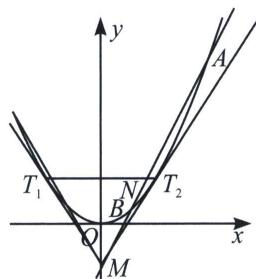

<!-- question-source:start -->
例3 (2021·深圳二模)已知实数 $p > 0$ ，且过点 $M(0, -p^2)$ 的直线 $l$ 与曲线 $C: x^2 = 2py$ 交于 $A$ 、 $B$ 两点.

(1)设 O 为坐标原点，直线 OA、OB 的斜率分别为 $k_{1}$ 、 $k_{2}$ ，若 $k_{1}k_{2}=1$ ，求 p 的值；

(2)设直线 $MT_{1}$ 、 $MT_{2}$ 与曲线 C 分别相切于点 $T_{1}$ 、 $T_{2}$ ，点 N 为直线 $T_{1}T_{2}$ 与弦 AB 的交点，且 $\overrightarrow{MA} = \lambda \overrightarrow{MN}$ ， $\overrightarrow{MB} = \mu \overrightarrow{MN}$ ，证明： $\frac{1}{\lambda} + \frac{1}{\mu}$ 为定值.

<!-- question-source:end -->

![[高中/总复习/专题/2026版高中《mst老唐说题》圆锥曲线专题（数学）/上册/第06章_联立之同构方程/第三节_比值参数同构/例题/answers/Q00053032A1.md]]
