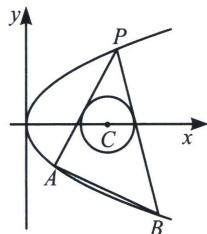
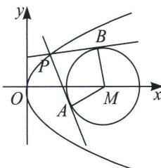

## 一、坐标点式同构和斜率同构区别

我们前面两讲的内容都是点式同构，就是两个点可以对称轮换，这就需要直线与同一曲线有两个交点，于是抛物线的两点式方程和椭圆(双曲线)三角两点式方程应运而生。同构是一个强调对称和等位的操作手法，所以我们一定要精确理解，用好了确实能在解题中达到事半功倍的效果.

如果一条直线跟两个不同曲线交于两个不同的点，由于是同一条直线，故斜率不会改变，但是由于交于两条曲线，故此时我们利用不变的斜率来构造同构(同解)方程，便是我们说到的斜率同构.

  
图 1: 点式同构

  
图 2: 斜率同构

看图1，我们发现 $P$ 、 $A$ 、 $B$ 三点都在抛物线上，这样三点我们称之为等位三点，就能构成三个同构式方程，即 $\left\{ \begin{array}{l} l_{PA}: (y_P + y_A)y = 2px + yPy_A \\ l_{PB}: (y_P + y_B)y = 2px + yPy_B \end{array} \right.$ ，还有 $l_{AB}: (y_A + y_B)y = 2px + y_Ay_B$ ，之所以这样分开表达，就是我们发现 $PA$ 、 $PB$ 均与圆 $C$ 相切，所以它们完全等位，即利用点 $C$ 到两条直线距离相等又能得到新的同构方程，但是 $l_{AB}$ 并不一定能满足。如果圆 C 与三条直线都相切，就是我们熟悉的彭塞列闭合圆。

再来看图 2，虽然 PA、PB 均与圆 C 相切，但是由于 A、B 均在圆 M 上，此时 P、A、B 不具备等位性，但是直线 PA 和 PB 具备等位性，因为相切，所以这两条直线的斜率就能构成同构方程，我们把这种两条直线分列不同曲线上，但是具备相同等位性质的类型，叫做斜率同构。
