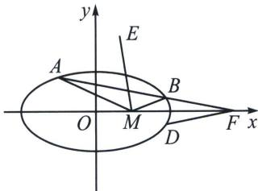

<!-- question-source:start -->
例⑪ (2025·南昌一模 T18)已知椭圆 $C: \frac{x^{2}}{a^{2}} + \frac{y^{2}}{b^{2}} = 1 (a > b > 0)$ 的离心率 $e = \frac{\sqrt{3}}{2}$ , 过点 $P(4, 0)$ 作直线 $l$ 与椭圆 $C$ 交于 $A$ , $B$ 两点 ( $A$ 在 $B$ 上方), 当 $l$ 的斜率为 $-\frac{1}{4}$ 时, 点 $A$ 恰与椭圆的上顶点重合.

(1)求椭圆 C 的标准方程;

(2)已知 $M(1,0)$ ，设直线 MA，MB 的斜率分别为 $k_{1}$ ， $k_{2}$ ，设 $\triangle AMB$ 的外接圆圆心为 E。点 B 关于 x 轴的对称点为 D。

(i) 求 $k_{1} + k_{2}$ 的值；

(ii) 求证: $ME \perp PD$ .

(1) 易知直线 $l: y = -\frac{1}{4} x + 1$ ，因为 $b = 1, e = \sqrt{1 - \frac{b^2}{a^2}}$ ，解得 $a = 2$ ，则椭圆 $C$ 的标准方程为 $\frac{x^2}{4} + y^2 = 1$ ;

(i) 利用定比点差法，参考本书下一章节，令 $\overrightarrow{AF} = \lambda \overrightarrow{FB} \Leftrightarrow \frac{x_1 + \lambda x_2}{1 + \lambda} = 4$ ，在直线 $AB$ 上存在一点 $Q$ ，使 $\overrightarrow{AQ} = -\lambda \overrightarrow{QB}$ ，故 $x_Q = \frac{x_1 - \lambda x_2}{1 - \lambda}$ ， $A$ 、 $B$ 两点在椭圆上，有 $\left\{ \begin{array}{l} \frac{x_1^2}{4} + y_1^2 = 1 \\ \frac{\lambda^2 x_2^2}{4} + \lambda^2 y_2^2 = \lambda^2 \end{array} \right.$

1-②得： $\frac{(x_1 + \lambda x_1)(x_1 - \lambda x_2)}{4(1 - \lambda^2)} +\frac{(y_1 + \lambda y_2)(y_1 - \lambda y_2)}{1 - \lambda^2} = 1$ ，即 $\frac{1}{4}\cdot \frac{x_1 + \lambda x_2}{1 + \lambda}\cdot \frac{x_1 - \lambda x_2}{1 - \lambda} +0\cdot \frac{y_1 + \lambda y_2}{1 - \lambda} = 1$ $\Rightarrow \frac{x_{F}x_{Q}}{4} = 1\Rightarrow x_{Q} = \frac{x_{1} - \lambda x_{2}}{1 - \lambda} = 1,$

所以 $\left\{ \begin{array}{l}x_{1} + \lambda x_{2} = 4(1 + \lambda)\\ x_{1} - \lambda x_{2} = 1 - \lambda \\ y_{1} + \lambda y_{2} = 0 \end{array} \right.\Rightarrow \left\{ \begin{array}{l}x_{1} = \frac{5}{2} -\frac{3}{2}\lambda \\ x_{2} = \frac{5}{2} -\frac{3}{2\lambda}\\ y_{1} + \lambda y_{2} = 0 \end{array} \right.$ ，所以 $k_{1} + k_{2} = \frac{y_{1}}{x_{1} - x_{M}} +\frac{y_{2}}{x_{2} - x_{M}} = 0;$

(ii) 解法一：同解同构： $\left\{\begin{aligned} &^{(x-m)2+(y-n)2=(m-1)2+n^{2}}\\ &x=ty+4\end{aligned}\right.$ ，所以 $y^{2}(1+t^{2})+(8t-2mt-2n)y+15-$ 6m=0, $\left\{\begin{aligned}\frac{x^{2}}{4}+y^{2}=1\\ x=ty+4\end{aligned}\right.$ ，所以 $y^{2}(4+t^{2})+8ty+12=0$ ，由于 $y_{1}$ 和 $y_{2}$ 同解，所以 $\frac{1+t^{2}}{4+t^{2}}=\frac{4t-mt-n}{4t}=\frac{5-2m}{4}$ 所以 $m-1=\frac{n}{t}$ ， $ME\perp PD$ 等价于 $\frac{n}{m-1}\cdot-\frac{1}{t}=-1$ ，即 $m-1=\frac{n}{t}$ ，得证。
<!-- question-source:end -->

![[高中/总复习/专题/2026版高中《mst老唐说题》圆锥曲线专题（数学）/上册/第06章_联立之同构方程/第二节_斜率同构式与坐标同构式的应用/七_坐标同解同构方程_外接圆_/例题/answers/Q00048960A1.md]]
