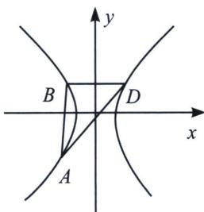

<!-- question-source:start -->
例10 (2022·南京联考)双曲线 $C: \frac{x^{2}}{a^{2}} - \frac{y^{2}}{b^{2}} = 1 ((a > b > 0)$ 经过点 $(\sqrt{3}, 1)$ 且渐近线方程为 $y = \pm x$

(1)求 $a, b$ 的值

(2)点 A, B, D 是双曲线 C 上不同的三个点，且 B, D 两点关于 y 对称， $\triangle ABD$ 的外接圆经过原点 O，求证：直线 AB 与圆 $x^{2} + y^{2} = 1$ 相切

##
<!-- question-source:end -->

![[高中/总复习/专题/2026版高中《mst老唐说题》圆锥曲线专题（数学）/上册/第06章_联立之同构方程/第二节_斜率同构式与坐标同构式的应用/七_坐标同解同构方程_外接圆_/例题/answers/Q00053027A1.md]]
