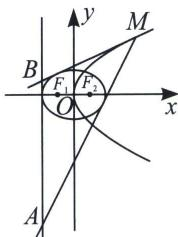

<!-- question-source:start -->
例3 (2024·湖南模拟)已知抛物线 $C: y^{2} = 2px (p > 0)$ 的焦点为点 $F, P$ 为 $C$ 上一点, 若点 $P$ 到原点的距离与点 $P$ 到点 $F$ 的距离都是 $\frac{3}{2}$ .

(1) 求 C 的标准方程;

(2)动点 $M$ 在抛物线 $C$ 上, 且在直线 $x = 2$ 的右侧, 过点 $M$ 作椭圆 $E: \frac{x^2}{4} + \frac{y^2}{3} = 1$ 的两条切线分别交直线 $x = -2$ 于 $A$ , $B$ 两点. 当 $|AB| = 10$ 时, 求点 $M$ 的坐标.

<!-- question-source:end -->

![[高中/总复习/专题/2026版高中《mst老唐说题》圆锥曲线专题（数学）/上册/第06章_联立之同构方程/第二节_斜率同构式与坐标同构式的应用/三_双切椭圆双曲线的斜率同构/例题/answers/Q00053022A1.md]]
