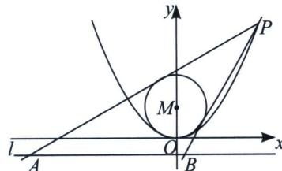

<!-- question-source:start -->
例1 (2024·大理期末)如图, 点 $P$ 是抛物线 $x^{2} = 4y$ 在第一象限内的动点, 过点 $P$ 作圆 $M: x^{2} + (y - 2)^{2} = 4$ 的两条切线, 分别交抛物线的准线 $l$ 于点 $A$ , $B$ .

(1)当 $\angle APB=90^{\circ}$ 时，求点P的坐标；

(2)当点 P 的横坐标大于 4 时，求 $\triangle PAB$ 面积 S 的最小值.

<!-- question-source:end -->

![[高中/总复习/专题/2026版高中《mst老唐说题》圆锥曲线专题（数学）/上册/第06章_联立之同构方程/第二节_斜率同构式与坐标同构式的应用/二_圆锥曲线上的双切圆斜率同构/例题/answers/Q00048612A1.md]]
