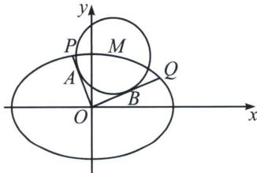

## 五、由内准圆引起的斜率同构

已知 $M(x_{0}, y_{0})$ 是椭圆 $\frac{x^{2}}{a^{2}} + \frac{y^{2}}{b^{2}} = 1 (a > b > 0)$ 上的一点，过原点 O 作圆 $M: (x - x_{0})^{2} + (y - y_{0})^{2} = r^{2}$ 两条切线，切点为 A、B，且与椭圆交于点 P、Q，记 $k_{OP} = k_{1}$ ， $k_{OQ} = k_{2}$ ，则有以下等价条件：

$$
① r ^ {2} = \frac {a ^ {2} b ^ {2}}{a ^ {2} + b ^ {2}}; ② k _ {1} k _ {2} = - \frac {b ^ {2}}{a ^ {2}}; ③ | O A | ^ {2} + | O B | ^ {2} = a ^ {2} + b ^ {2}.
$$

我们仅以条件①为已知条件来进行证明：

因为直线 OP: $y=k_{1}x$ , OQ: $y=k_{2}x$ ，与圆 M 相切，所以直线 OP: $y=k_{1}x$ 与圆 $M:(x-x_{0})^{2}+(y-y_{0})^{2}=r^{2}$ 联立，可得 $r^{2}=\frac{a^{2}b^{2}}{a^{2}+b^{2}}=\frac{(k_{1}x_{0}-y_{0})^{2}}{1+k_{1}^{2}}=\frac{(k_{2}x_{0}-y_{0})^{2}}{1+k_{2}^{2}}$ , $k_{1}$ , $k_{2}$ 是同构方程 $(x_{0}^{2}-r^{2})k^{2}-2x_{0}y_{0}k+y_{0}^{2}-r^{2}=0$ 的两个不相等的实数根，所以 $k_{1}k_{2}=\frac{y_{0}^{2}-r^{2}}{x_{0}^{2}-r^{2}}$ ，因为点 $M(x_{0},y_{0})$ 在椭圆 C 上，所以 $y_{0}^{2}=b^{2}-\frac{b^{2}x_{0}^{2}}{a^{2}}$ ，所以 $k_{1}k_{2}=-\frac{b^{2}}{a^{2}}$ ，设 $P(x_{1},y_{1})$ , $Q(x_{2},y_{2})$ ，所以 $\frac{y_{1}}{x_{1}}\cdot\frac{y_{2}}{x_{2}}=-\frac{b^{2}}{a^{2}}$ ，所以 $(y_{1}y_{2})^{2}=\frac{b^{4}}{a^{4}}(x_{1}x_{2})^{2}$ ，又 $\left\{\frac{x_{1}^{2}}{a^{2}}+\frac{y_{1}^{2}}{b^{2}}=1\right.$ ，所以 $(y_{1}y_{2})^{2}=\left(b^{2}-\frac{b^{2}}{a^{2}}x_{1}^{2}\right)\left(b^{2}-\frac{b^{2}}{a^{2}}x_{2}^{2}\right)=\frac{b^{4}}{a^{4}}(x_{1}x_{2})^{2}$ ，所以 $x_{1}^{2}+x_{2}^{2}=a^{2}$ ，同理 $y_{1}^{2}+y_{2}^{2}=b^{2}$ ，

所以 $|OA|^{2}+|OB|^{2}=x_{1}^{2}+y_{1}^{2}+x_{2}^{2}+y_{2}^{2}=a^{2}+b^{2}$

![[高中/总复习/专题/2026版高中《mst老唐说题》圆锥曲线专题（数学）/上册/第06章_联立之同构方程/第二节_斜率同构式与坐标同构式的应用/五_由内准圆引起的斜率同构/例题/Q00048618.md]]
