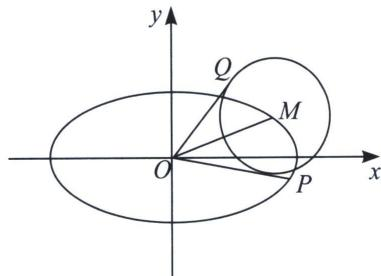

<!-- question-source:start -->
例7 (2021·浙江模拟)如图, 在平面直角坐标系 $xOy$ 中, 设点 $M(x_0, y_0)$ 是椭圆 $C: \frac{x^2}{16} + \frac{y^2}{4} = 1$ 上一点, 从原点 $O$ 向圆 $M: (x - x_0)^2 + (y - y_0)^2 = r^2$ 作两条切线, 分别与椭圆 $C$ 交于点 $P$ , $Q$ , 直线 $OP$ , $OQ$ 的斜率分别记为 $k_1$ , $k_2$ .

(1) 若圆 M 与 x 轴相切于椭圆 C 的右焦点，求圆 M 的方程；

(2) 若 $r=\frac{4\sqrt{5}}{5}$ ，求证： $k_{1}k_{2}=-\frac{1}{4}$ ;

(3)在
(2)的情况下，求 $|OP|\cdot|OQ|$ 的最大值.

(1)椭圆 $C$ 的右焦点是 $(2\sqrt{3}, 0)$ , 将 $x = 2\sqrt{3}$ , 代入 $\frac{x^2}{16} + \frac{y^2}{4} = 1$ , 可得 $y = \pm 1$ ,

所以 $M(2\sqrt{3}, \pm1)$ ，所以圆 M 的方程为 $(x-2\sqrt{3})^{2}+(y\pm1)^{2}=1$ .

(2)证明: 因为直线 $OP: y = k_{1}x$ , $OQ: y = k_{2}x$ , 与圆 $M$ 相切, 所以直线 $OP: y = k_{1}x$ 与圆 $M: (x - x_{0})^{2} + (y - y_{0})^{2} = \frac{16}{5}$ 联立, 可得 $(1 + k_{1}^{2})x^{2} - (2x_{0} + 2k_{1}y_{0})x + x_{0}^{2} + y_{0}^{2} - \frac{16}{5} = 0$

同理 $(1 + k_2^2)x^2 -(2x_0 + 2k_2y_0)x + x_0^2 +y_0^2 -\frac{16}{5} = 0,$

由判别式为0，可得 $k_{1}$ ， $k_{2}$ 是方程 $\left(x_0^2 -\frac{16}{5}\right)k^2 -2x_0y_0k + y_0^2 -\frac{16}{5} = 0$ 的两个不相等的实数根，

所以 $k_{1}k_{2} = \frac{y_{0}^{2} - \frac{16}{5}}{x_{0}^{2} - \frac{16}{5}}$ ，因为点 $M(x_0,y_0)$ 在椭圆 $C$ 上，所以 $y_0^2 = 4 - \frac{x_0^2}{4}$ ，所以 $k_{1}k_{2} = -\frac{1}{4}$

(3)设 $P(x_{1}, y_{1})$ ， $Q(x_{2}, y_{2})$ ，因为 $4k_{1}k_{2}+1=0$ ，所以 $y_{1}^{2}y_{2}^{2}=\frac{1}{16}x_{1}^{2}x_{2}^{2}$ ，因为 $P(x_{1}, y_{1})$ ， $Q(x_{2}, y_{2})$ 在椭圆 C 上，所以 $y_{1}^{2}y_{2}^{2}=\left(4-\frac{x_{1}^{2}}{4}\right)\left(4-\frac{x_{2}^{2}}{4}\right)=\frac{1}{16}x_{1}^{2}x_{2}^{2}$ ，整理得 $x_{1}^{2}+x_{2}^{2}=16$ ，

所以 $y_{1}^{2}+y_{2}^{2}=4$ ，所以 $OP^{2}+OQ^{2}=20$ .

所以 $|OP| \cdot |OQ| \leqslant \frac{1}{2}(OP^2 + OQ^2) = 10$ ，所以 $|OP| \cdot |OQ|$ 的最大值为 10.
<!-- question-source:end -->

![[高中/总复习/专题/2026版高中《mst老唐说题》圆锥曲线专题（数学）/上册/第06章_联立之同构方程/第二节_斜率同构式与坐标同构式的应用/五_由内准圆引起的斜率同构/例题/answers/Q00048618A1.md]]
