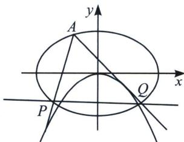

<!-- question-source:start -->
例12 $\frac{x^2}{4} + \frac{y^2}{3} = 1$ 上一点 $A(-1, \frac{3}{2})$ ，过 $A$ 作两直线与 $y = tx^2 (t < 0)$ 相切，分别交椭圆于 $P$ 、 $Q$ 两点，求证 $PQ$ 过定点.

<!-- question-source:end -->

![[高中/总复习/专题/2026版高中《mst老唐说题》圆锥曲线专题（数学）/上册/第06章_联立之同构方程/第二节_斜率同构式与坐标同构式的应用/八_双切曲线的斜率同解同构/例题/answers/Q00048622A1.md]]
