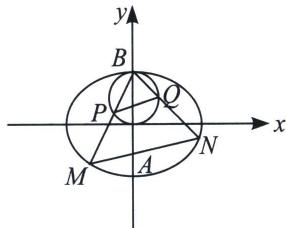

> [!faq]- 《圆锥曲线专题(上册)》例题解析
>
> > [!success]- **【答案】** 详见解析
>
> > [!note]- **【解析】**
> > 解析 (1) $\frac{x^2}{8} + \frac{y^2}{4} = 1$
> >
> > (2)
> > 解法一(齐次化): 将椭圆按 $\overrightarrow{BO} = (0, -2)$ 平移, 得: $\frac{x^{2}}{8} + \frac{(y+2)^{2}}{4} = 1$ , 即 $\frac{x^{2}}{8} + \frac{y^{2}}{4} + y = 0$ . 因为 $M^{\prime}N^{\prime}: mx - \frac{1}{3}y = 1$ (过点 $(0, -3)$ ), 所以 $\frac{x^{2}}{8} + \frac{y^{2}}{4} + y(mx - \frac{y}{3}) = 0$ , 所以 $k_{BM}k_{BN} = -\frac{3}{2}$ , $k_{BM} + k_{BN} = 12m$ ,
> >
> > 将椭圆按 $\overrightarrow{BO}=(0,-2)$ 平移，得 $x^{2}+(y+1)^{2}=1$ ，令 $l_{P'Q'}:px+qy=1$ ，即 $x^{2}+y^{2}+2y(px+qy)=0$ ，即 $\frac{y^{2}}{x^{2}}(1+2q)+2p\cdot\frac{y}{x}+1=0$ ，所以 $k_{BP}+k_{BQ}=k_{BM}+k_{BN}=\frac{-2p}{1+2q}$ ， $k_{BP}\cdot k_{BQ}=k_{BM}\cdot k_{BN}=-\frac{3}{2}=\frac{1}{1+2q}$ ，所以 $q=-\frac{5}{6}$ ，所以12m=3p，所以p=4m，所以 $k_{1}=3m$ ， $k_{2}=-\frac{p}{q}=\frac{24}{5}m$ 。故 $\lambda=\frac{k_{2}}{k_{1}}=\frac{8}{5}$ 。
> >
> > 
> >
> > 解法二(同构): 设 $MN: y = k_{1}x - 1$ , $PQ: y = k_{2}x + m$ , $BM: y = k_{3}x + 2$ , $BN: y = k_{4}x + 2$ ,
> >
> > 则 $\left\{\begin{aligned}y=k_{1}x-1\\ y=k_{3}x+2\end{aligned}\Rightarrow M\left(\frac{3}{k_{1}-k_{3}},\frac{2k_{1}+k_{3}}{k_{1}-k_{3}}\right)$ ，代入椭圆E方程得： $2k_{3}^{2}-8k_{1}k_{3}-3=0$
> >
> > 同理， $N\left(\frac{3}{k_{1}-k_{4}},\frac{2k_{1}+k_{4}}{k_{1}-k_{4}}\right)$ ，代入椭圆方程得： $2k_{4}^{2}-8k_{1}k_{4}-3=0$
> >
> > 所以 $k_{3}, k_{4}$ 是同构方程 $2k^{2} - 8kk_{1} - 3 = 0$ 两个根，所以 $k_{3} + k_{4} = 4k_{1}$ ， $k_{3}k_{4} = -\frac{3}{2}$ ；
> >
> > $\left\{\begin{aligned}y=k_{2}x+m\\ y=k_{3}x+2\end{aligned}\right.\Rightarrow P\left(\frac{2-m}{k_{2}-k_{3}},\quad\frac{2k_{2}-mk_{3}}{k_{2}-k_{3}}\right)$ ，代入圆C方程得： $mk_{3}^{2}-2k_{2}k_{3}+m-2=0$
> >
> > 同理： $Q\left(\frac{2-m}{k_{2}-k_{4}},\frac{2k_{2}-mk_{4}}{k_{2}-k_{4}}\right)$ ，代入圆 C 方程得： $mk_{4}^{2}-2k_{2}k_{4}+m-2=0$ ，
> >
> > 所以 $k_{3}, k_{4}$ 是同构方程 $mk^{2} - 2kk_{2} + m - 2 = 0$ 两个根，所以 $k_{3} + k_{4} = \frac{2k_{2}}{m}$ ， $k_{3}k_{4} = \frac{m - 2}{m}$ ；
> >
> > 所以有 $k_{3}k_{4} = -\frac{3}{2} = \frac{m - 2}{m}\Rightarrow m = \frac{4}{5}, k_{3} + k_{4} = 4k_{1} = \frac{2k_{2}}{m}\Rightarrow k_{2} = 2mk_{1} = \frac{8}{5} k_{1}$ ，所以 $\lambda = \frac{8}{5}$
> >
> > 这里由于是第三条弦的斜率比值，还涉及不同曲线，同构的同解方程式最好理解的，齐次化依然还是计算量最小，这也是齐次化已经在处理共顶点斜率和积问题的最大优势.
