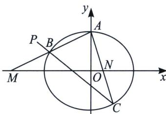

<!-- question-source:start -->
例8（2022·北京卷）已知椭圆 $E: \frac{x^2}{a^2} + \frac{y^2}{b^2} = 1 (a > b > 0)$ 的一个顶点为 $A(0, 1)$ ，焦距为 $2\sqrt{3}$ .

(1)求椭圆 E 的方程;

(2)过点 $P(-2,1)$ 作斜率为 k 的直线与椭圆 E 交于不同的两点 B, C, 直线 AB, AC 分别与 x 轴交于点 M, N. 当 $|MN|=2$ 时，求 k 的值.

## 解析
(1) $\frac{x^{2}}{4}+y^{2}=1$

(2)设 $AM: y = k_{1}x + 1, AN: y = k_{2}x + 1, BC: y = k(x + 2) + 1$ ，则 $x_{M} = -\frac{1}{k_{1}}, x_{N} = -\frac{1}{k_{2}}$ ，所以 $|MN| = \left|\frac{1}{k_1} - \frac{1}{k_2}\right|$ ，

<!-- source-part:4 pages:241-320 -->

$\left\{ \begin{array}{l} l_{AM}: y = k_1 + 1 \\ l_{BC}: y = k(x + 2) + 1 \end{array} \right. \Rightarrow B\left( \frac{2k}{k_1 - k}, \frac{(2k + 1)k_1 - k}{k_1 - k} \right)$ 代入椭圆 $\left( \frac{2k}{k_1 - k} \right)^2 + 4 \cdot \left[ \frac{(2k + 1)k_1 - k}{k_1 - k} \right]^2 = 4$ $\Rightarrow 4k(k + 1)k_1^2 - 4k^2k_1 + k^2 = 0$ ，同理 $4k(k + 1)k_2^2 - 4k^2k_2 + k^2 = 0$ ，故 $k_1, k_2$ 是同构方程 $4k(k + 1)x^2 - 4k^2x + k^2 = 0$ 的两根，所以 $\left\{ \begin{array}{l} k_1 + k_2 = \frac{k}{k + 1} \\ k_1k_2 = \frac{k}{4(k + 1)} \end{array} \right. \Rightarrow \left\{ \begin{array}{l} \frac{1}{k_1} + \frac{1}{k_2} = 4 \\ \frac{1}{k_1k_2} = \frac{4(k + 1)}{k} \end{array} \right.$ 所以 $|MN| = \sqrt{\left( \frac{1}{k_1} + \frac{1}{k_2} \right)^2 - 4\frac{1}{k_1} \cdot \frac{1}{k_2}} = 2$ ，即 $\sqrt{16 - \frac{16(k + 1)}{k}} = 2 \Rightarrow k = -4$ .
<!-- question-source:end -->
