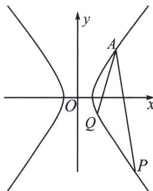

<!-- question-source:start -->
例9 (2022·新高考Ⅰ卷)已知 $A(2,1)$ 在双曲线 $C: \frac{x^2}{a^2} - \frac{y^2}{a^2 - 1} = 1 (a > 1)$ 上, 直线 $l$ 交 $C$ 于 $P$ 、 $Q$ 两点, 直线 $AP$ , $AQ$ 斜率之和为 0.

(1) 求 $l$ 的斜率;

(2) 若 $\tan\angle PAQ=2\sqrt{2}$ . 求 $\triangle PAQ$ 面积.

<!-- question-source:end -->

![[高中/总复习/专题/2026版高中《mst老唐说题》圆锥曲线专题（数学）/上册/第06章_联立之同构方程/第二节_斜率同构式与坐标同构式的应用/六_斜率和积为定值的同构/例题/answers/Q00053026A1.md]]
