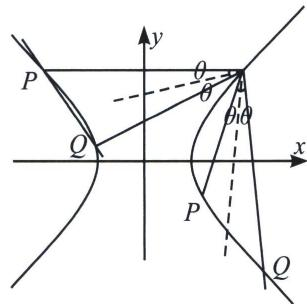

> [!faq]- 《圆锥曲线专题(上册)》例题解析
>
> > [!success]- **【答案】** 详见解析
>
> > [!note]- **【解析】**
> > 解析 (1)将点 $A(2, 1)$ 代入双曲线 $C: \frac{x^2}{a^2} - \frac{y^2}{a^2 - 1} = 1 (a > 1)$ , 得 $a = \sqrt{2}$ , 所以双曲线 $C: \frac{x^2}{2} - y^2 = 1$ , 令 $PQ: y = kx + m$ , $AP$ 斜率为 $k_1$ , $AQ$ 斜率为 $k_2$ ,
> >
> > $$
> > \left\{ \begin{array}{l} \frac {x ^ {2}}{2} - y ^ {2} = 1 \\ y = k _ {1} x + 1 - 2 k _ {1} \end{array} \Rightarrow (1 - 2 k _ {1} ^ {2}) x ^ {2} - 4 k _ {1} (1 - 2 k _ {1}) x - 2 [ (1 - 2 k _ {1}) ^ {2} + 1 ] = 0, \right.
> > $$
> >
> > $x_{P} \cdot x_{A} = \frac{-2[(1 - 2k_{1})^{2} + 1]}{1 - 2k_{1}^{2}} \Rightarrow x_{P} = \frac{-4k_{1}^{2} + 4k_{1} - 2}{1 - 2k_{1}^{2}}$ ，所以 $y_{P} = k_{1}(x_{P} - 2) + 1 = \frac{2k_{1}^{2} - 4k_{1} + 1}{1 - 2k_{1}^{2}}$
> >
> > 因为 $P$ 在 $PQ$ 上，所以 $\frac{-4k_1^2 + 4k_1 - 2}{1 - 2k_1^2} = \frac{(2k_1^2 - 4k_1 + 1) \cdot k}{1 - 2k_1^2} + m, \Rightarrow (-2m + 2k + 4)k_1^2 + (-4 - 4k)k_1 + m + k + 2 = 0$ ，同理： $(-2m + 2k + 4)k_2^2 + (-4 - 4k)k_2 + m + k + 2 = 0,$
> >
> > 所以 $k_{1}$ ， $k_{2}$ 是同构方程： $(-2m + 2k + 4)x^{2} + (-4 - 4k)x + m + k + 2 = 0$ 的两根，
> >
> > 所以 $k_{1} + k_{2} = \frac{4k + 4}{-2m + 2k + 4} = 0$ ，则 $k = -1$
> >
> > (2) $k_{l}=-1<-\frac{\sqrt{2}}{2}$ ，①若PQ与左支交于两点，经检验不成立；
> > - **②**：若PQ与右支交于两点．如图：
> >
> > 
> >
> > $\tan 2\theta = \frac{2\tan\theta}{1 - \tan^2\theta} = 2\sqrt{2}$ 得： $\tan \theta = \frac{\sqrt{2}}{2}$ ，所以 $k_{AP} = \frac{1}{\frac{\sqrt{2}}{2}} = \sqrt{2}, k_{AQ} = -\frac{1}{\frac{\sqrt{2}}{2}} = -\sqrt{2}$ （不妨设 $P$ 在 $Q$ 上方）
> >
> > 由(1)得： $x_{P}=\frac{-4k_{1}^{2}+4k_{1}-2}{1-2k_{1}^{2}}=\frac{10-4\sqrt{2}}{3}$ ， $x_{Q}=\frac{-4k_{2}^{2}+4k_{2}-2}{1-2k_{2}^{2}}=\frac{10+4\sqrt{2}}{3}$
> >
> > $$
> > \mid A P \mid = \sqrt {1 + k _ {1} ^ {2}} \mid x _ {P} - x _ {A} \mid = \frac {4 \sqrt {2} - 4}{\sqrt {3}}, \mid A Q \mid = \sqrt {1 + k _ {2} ^ {2}} \mid x _ {Q} - x _ {A} \mid = \frac {4 + 4 \sqrt {2}}{\sqrt {3}},
> > $$
> >
> > $$
> > S = \frac {1}{2} | A P | \cdot | A Q | \sin 2 \theta = \frac {1}{2} t _ {1} t _ {2} \frac {2 \sqrt {2}}{3} = \frac {1 6 \sqrt {2}}{9}
> > $$
> >
> > 注意 虽然斜率同构也是用了等位的思想来解决问题，但是这里少不了计算，在斜率和积，尤其在这种曲线内的三角形的斜率和积问题处理上，同构不如齐次化计算简单，不过齐次化解决不了本题第二问，因为同构的坐标就是用斜率来表示的，尤其在双切圆或者双切椭圆双曲线上，同构优势巨大.
> >
> > 我们再来看看同构的一些具有独特的存在.
