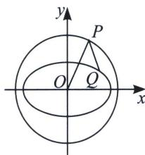

> [!faq]- 《圆锥曲线专题(上册)》例题解析
>
> > [!success]- **【答案】** AC
>
> > [!note]- **【解析】**
> > 解析 对于 A，在平面直角坐标系 xOy 中，椭圆 C: $\frac{x^{2}}{4} + y^{2} = 1$ ，所以 a = 2, b = 1，则 $c = \sqrt{3}$ ，故 $e = \frac{c}{a} = \frac{\sqrt{3}}{2}$ ，故 A 正确；
> >
> > 对于 BC，圆 O: $x^{2}+y^{2}=5$ ，P 为圆 O 上任意一点，Q 为椭圆 C 上任意一点，设 $Q(x, y)$ ， $-2 \leqslant x \leqslant 2$ ，则 $\frac{x^{2}}{4} + y^{2} = 1$ ，而圆 O: $x^{2} + y^{2} = 5$ 的圆心 $O(0, 0)$ ，半径为 $r = \sqrt{5}$ ，则 $|OQ| = \sqrt{x^{2} + y^{2}} = \sqrt{x^{2} + 1 - \frac{x^{2}}{4}} = \sqrt{\frac{3}{4}x^{2} + 1}$ ，因为 $-2 \leqslant x \leqslant 2$ ，所以 $0 \leqslant x^{2} \leqslant 4$ ，则 $1 \leqslant \frac{3}{4}x^{2} + 1 \leqslant 4$ ，所以 $1 \leqslant \sqrt{\frac{3}{4}x^{2} + 1} \leqslant 2$ ，即 $1 \leqslant |OQ| \leqslant 2$ ，所以 $|PQ|$ 的最小值为 $r - 2 = \sqrt{5} - 2$ ，最大值为 $r + 2 = \sqrt{5} + 2$ ，故 B 错误，C 正确；
> >
> > 
> >
> > 对于 D，设 $P(x_{0}, y_{0})$ ， $x_{0}^{2} + y_{0}^{2} = 5$ ，过点 P 的直线方程为： $y - y_{0} = k(x - x_{0})$ ，联立 $\left\{\begin{aligned} &y - y_{0} = k(x - x_{0}) \\ &\frac{x^{2}}{4} + y^{2} = 1\end{aligned}\right.$ ，(1 + 4 $k^{2}$ ) $x^{2} + 8k(y_{0} - kx_{0})x + 4(y_{0} - kx_{0})^{2} - 4 = 0$ ，根据直线与椭圆的相切，则 $\Delta = [8k(y_{0} - kx_{0})]^{2} - 4(1 + 4k^{2})[4(y_{0} - kx_{0})^{2} - 4] = 0$ ，化简可得， $(x_{0}^{2} - 4)k^{2} - (2x_{0}y_{0})k + y_{0}^{2} - 1 = 0$ ，可知 $k_{1}$ ， $k_{2}$ 是方程的两个根，所以 $k_{1}k_{2} = \frac{y_{0}^{2} - 1}{x_{0}^{2} - 4} = \frac{4 - x_{0}^{2}}{x_{0}^{2} - 4} = -1$ ，所以 $k_{1}^{2} + k_{2}^{2} \geqslant 2|k_{1}k_{2}| = 2$ ，当且仅当 $|k_{1}| = |k_{2}|$ 取等号，故 D 错误。
> >
> > 故选 **AC**.
