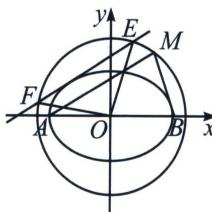

> [!faq]- 《圆锥曲线专题(上册)》例题解析
>
> > [!success]- **【答案】** ACD
>
> > [!note]- **【分析】**
> > 本题未单列分析。
>
> > [!note]- **【解析】**
> > 解析 A 选项，由题意得边长为 $2 \sqrt{6}$ 的正方形为 $\frac{x^2}{9} + \frac{y^2}{b^2} = 1 (0 < b < 3)$ 的蒙日圆的内接正方形，故 $\sqrt{9 + b^2} = \frac{2 \sqrt{6} \times \sqrt{2}}{2}$ ，解得 $b^2 = 3, b = \sqrt{3}$ ，A 正确；
> > B 选项, 若矩形的四条边均与椭圆 $C$ 相切, 则该矩形为 $\frac{x^{2}}{9} + \frac{y^{2}}{3} = 1$ 的蒙日圆的内接矩形, 其中蒙日圆的半径为 $\frac{2\sqrt{6} \times \sqrt{2}}{2} = 2\sqrt{3}$ , 设矩形的长为 $x$ , 宽为 $y$ , 故 $x^{2} + y^{2} = (4\sqrt{3})^{2} = 48$ , 故矩形面积为 $xy \leqslant \frac{x^{2} + y^{2}}{2} = 24$ , 当且仅当 $x = y = 2\sqrt{6}$ 时, 等号成立, 故该矩形面积的最大值为 24 , B 错误;
> > C选项, 法一(直译): 由题意得 $A(-3,0), B(3,0)$ , 蒙日圆方程为 $x^{2} + y^{2} = 12$ ,
> > 设 $M(2\sqrt{3}\cos \theta ,2\sqrt{3}\sin \theta)$ ，故 $\left|MA\right| = \sqrt{(2\sqrt{3}\cos\theta + 3)^2 + (2\sqrt{3}\sin\theta)^2} = \sqrt{21 + 12\sqrt{3}\cos\theta},$
> > $|MB|=\sqrt{(2\sqrt{3}\cos\theta-3)^{2}+(2\sqrt{3}\sin\theta)^{2}}=\sqrt{21-12\sqrt{3}\cos\theta}$ ，由 $|MA|=\sqrt{3}|MB|$ 得 $\sqrt{21+12\sqrt{3}\cos\theta}=\sqrt{3}\sqrt{21-12\sqrt{3}\cos\theta}$ ，故 $21+12\sqrt{3}\cos\theta=3(21-12\sqrt{3}\cos\theta)$ ，解得 $\cos\theta=\frac{7\sqrt{3}}{24}$ ，显然M点可能在第一象限或第四象限，C正确；
> > 法二(构造阿氏圆): $|MA| = \sqrt{3} |MB|$ , 则 $M$ 在一个阿氏圆上, 根据阿氏圆半径公式 $r = \frac{|AB|}{\lambda - \frac{1}{\lambda}} = \frac{6}{\sqrt{3} - \frac{\sqrt{3}}{3}} = 3\sqrt{3}$ , 且阿氏圆圆心 $O'(m, 0)$ 满足 $r^2 = |O'A||O'B| \Rightarrow 27 = (m-3)(m+3) \Rightarrow m=6$ , 故阿氏圆为 $(x-6)^2 + y^2 = 27$ , 与蒙日圆 $x^2 + y^2 = 12$ 有两个交点, C 正确;
> > 
> > D选项，法一：由于椭圆 $E: \frac{x^2}{a^2} + \frac{y^2}{b^2} = 1 (a > b > 0)$ 在 $P(x_0, y_0)$ 处的切线方程为 $\frac{x_0x}{a^2} + \frac{y_0y}{b^2} = 1$ ，设切点为 $R(x_0, y_0)$ ，则椭圆 $C$ 的切线方程为 $\frac{x_0x}{9} + \frac{y_0y}{3} = 1$ ，联立 $\frac{x_0x}{9} + \frac{y_0y}{3} = 1$ 与 $x^2 + y^2 = 12$ 得 $(x_0^2 + 9y_0^2)x^2 - 18x_0x + 81 - 108y_0^2 = 0$ ，设 $E(x_1, y_1), F(x_2, y_2)$ ，则 $x_1 + x_2 = \frac{18x_0}{x_0^2 + 9y_0^2}, x_1x_2 = \frac{81 - 108y_0^2}{x_0^2 + 9y_0^2}$ ，
> > $$
> > y _ {1} y _ {2} = \left(\frac {3}{y _ {0}} - \frac {x _ {0} x _ {1}}{3 y _ {0}}\right) \left(\frac {3}{y _ {0}} - \frac {x _ {0} x _ {2}}{3 y _ {0}}\right) = \frac {9}{y _ {0} ^ {2}} - \frac {x _ {0}}{y _ {0} ^ {2}} \left(x _ {1} + x _ {2}\right) + \frac {x _ {0} ^ {2} x _ {1} x _ {2}}{9 y _ {0} ^ {2}} = \frac {9}{y _ {0} ^ {2}} - \frac {x _ {0}}{y _ {0} ^ {2}} \frac {1 8 x _ {0}}{x _ {0} ^ {2} + 9 y _ {0} ^ {2}} + \frac {x _ {0} ^ {2}}{9 y _ {0} ^ {2}} \cdot \frac {8 1 - 1 0 8 y _ {0} ^ {2}}{x _ {0} ^ {2} + 9 y _ {0} ^ {2}},
> > $$
> > 将 $x_{0}^{2}=9-3y_{0}^{2}$ 代入得， $x_{1}x_{2}=\frac{81-108y_{0}^{2}}{x_{0}^{2}+9y_{0}^{2}}=\frac{81-108y_{0}^{2}}{9-3y_{0}^{2}+9y_{0}^{2}}=\frac{27-36y_{0}^{2}}{2y_{0}^{2}+3}$
> > $y_{1}y_{2}=\frac{9}{y_{0}^{2}}-\frac{9-3y_{0}^{2}}{y_{0}^{2}}\frac{6}{3+2y_{0}^{2}}+\frac{9-3y_{0}^{2}}{y_{0}^{2}}\cdot\frac{3-4y_{0}^{2}}{3+2y_{0}^{2}}=\frac{12y_{0}^{2}-9}{2y_{0}^{2}+3}$ ，故 $k_{1}k_{2}=\frac{y_{1}y_{2}}{x_{1}x_{2}}=\frac{12y_{0}^{2}-9}{2y_{0}^{2}+3}\div\frac{27-36y_{0}^{2}}{2y_{0}^{2}+3}=-\frac{1}{3}$ ，为定值，
> > 法二(齐次化): $x^{2} + y^{2} = 12\left(\frac{xx_{0}}{9} + \frac{yy_{0}}{3}\right)^{2}$ , 同除以 $x^{2}$ 得: $\frac{y^{2}}{x^{2}}\left(\frac{4}{3}y_{0}^{2} - 1\right) + \frac{8}{9}x_{0}y_{0}\frac{y}{x} + \frac{4}{27}x_{0}^{2} - 1 = 0, k_{1}k_{2}$ $= \frac{\frac{4}{27}x_{0}^{2} - 1}{\frac{4}{3}y_{0}^{2} - 1} = \frac{\frac{4}{27}(9 - 3y_{0}^{2}) - 1}{\frac{4}{3}y_{0}^{2} - 1} = \frac{\frac{1}{3} - \frac{4}{9}y_{0}^{2}}{\frac{4}{3}y_{0}^{2} - 1} = -\frac{1}{3},$ D 正确.
> >
> > 故选 **ACD**.
