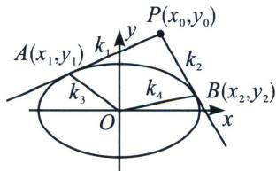

## 四、双切椭圆的蒙日圆

问题：过 $\frac{x^{2}}{a^{2}}+\frac{y^{2}}{b^{2}}=1(a>b>0)$ 外一点 $P(x_{0},y_{0})$ 作椭圆两条切线．切点分别为A、B，若 $k_{PA}\cdot k_{PB}=\lambda$

讨论 $P$ 的轨迹.

如果是切线同构成切点弦，这是走阿基米德三角形的线路，一旦涉及两切线斜率和积问题，用 $k_{PA}$ 构造一个联立式子，利用判别式为零，从而得出 $k_{PA}$ 的二次方程： $ak_{PA}^{2} + bk_{PA} + c = 0$ ，而 $k_{PB}$ 也满足这个方程，故 $k_{PA}$ 、 $k_{PB}$ 是此同构方程 $ak^{2} + bk + c = 0$ 的两个根，从而再利用韦达定理来确定 $k_{PA} \cdot k_{PB} = \lambda$ 的关系式。我们也可以理解为 $k_{PA}$ 确定方程 $ak^{2} + bk + c = 0$ ，而 $k_{PA}$ ， $k_{PB}$ 是此方程的根。

先联立看切线： $\left\{ \begin{array}{l} \frac{x^2}{a^2} +\frac{y^2}{b^2} = 1\\ y = kx + m \end{array} \right.\Rightarrow (a^2 k^2 +b^2)x^2 +2kma^2 x + a^2 (m^2 -b^2) = 0,\Delta = 0\Rightarrow a^2 k^2 +b^2 -m^2 = 0①,$

将 $m = y_{0} - kx_{0}$ 代入①得关于 $k$ 的一元一次方程： $(a^{2} - x_{0}^{2})k^{2} + 2x_{0}y_{0}k + b^{2} - y_{0}^{2} = 0$ ②，

易知 $k_{PA}$ 、 $k_{PB}$ 同时满足②式，故 $k_{PA}$ 、 $k_{PB}$ 是②式的两个根，我们设为 $k_{1}$ 、 $k_{2}$ ，

所以 $k_{1} \cdot k_{2} = \frac{b^{2} - y_{0}^{2}}{a^{2} - x_{0}^{2}} = \lambda$ ，所以 $\lambda x_{0}^{2} - y_{0}^{2} = \lambda a^{2} - b^{2}$ ；

(1) $\lambda<-1$ ，P为焦点在y轴上的椭圆；

(2) $\lambda=-1$ ，P为半径为 $r=\sqrt{a^{2}+b^{2}}$ 的圆，即“蒙日圆”；

(3) $\lambda\in(-1,0)$ ，P为焦点在x轴上的椭圆；

(4) $\lambda\in\left(0,\frac{b^{2}}{a^{2}}\right)$ ，P为焦点在y轴上的双曲线；

(5) $\lambda=\frac{b^{2}}{a^{2}}$ ，P为斜率为 $\pm\frac{b}{a}$ 的射线；

(6) $\lambda > \frac{b^2}{a^2}$ , $P$ 为焦点在 $x$ 轴上的双曲线;

![[高中/总复习/专题/2026版高中《mst老唐说题》圆锥曲线专题（数学）/上册/第06章_联立之同构方程/第二节_斜率同构式与坐标同构式的应用/四_双切椭圆的蒙日圆/例题/Q00048615.md]]
![[高中/总复习/专题/2026版高中《mst老唐说题》圆锥曲线专题（数学）/上册/第06章_联立之同构方程/第二节_斜率同构式与坐标同构式的应用/四_双切椭圆的蒙日圆/例题/Q00048616.md]]
![[高中/总复习/专题/2026版高中《mst老唐说题》圆锥曲线专题（数学）/上册/第06章_联立之同构方程/第二节_斜率同构式与坐标同构式的应用/四_双切椭圆的蒙日圆/例题/Q00048617.md]]
