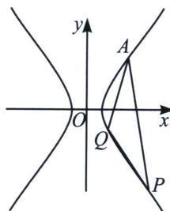
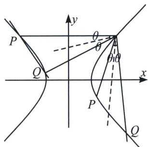

<!-- question-source:start -->
例4 (2022 新高考Ⅰ卷)已知 A(2, 1) 在双曲线 C: $\frac{x^{2}}{a^{2}} - \frac{y^{2}}{a^{2} - 1} = 1 (a > 1)$ 上，直线 l 交 C 于 P、Q 两点，直线 AP，AQ 斜率之和为 0.

(1) 求 l 的斜率;

(2) 若 $\tan\angle PAQ=2\sqrt{2}$ . 求 $\triangle PAQ$ 面积.

(1)将点 $A(2, 1)$ 代入双曲线方程得: $C: \frac{x^{2}}{2} - y^{2} = 1$ , 将 $A(2, 1), A \to O$ 平移到原点, 即 $\frac{(x+2)^{2}}{2} - (y+1)^{2} = 1$ , 即 $\frac{x^{2}}{2} - y^{2} + 2x - 2y = 0$ ; 设 $PQ$ 平移后直线为 $P'Q'$ , 令 $P'Q'$ 方程为: $mx + ny = 1$ , 即 $\frac{x^{2}}{2} - y^{2} + (2x - 2y)(mx + ny) = 0$ , $(1 + 2n)y^{2} - (2n - 2m)xy - \left(\frac{1}{2} + 2m\right)x^{2} = 0$ , 当 $x \neq 0$ 时, 同除以 $x^{2}$ , 得: $(1 + 2n)\left(\frac{y}{x}\right)^{2} + 2(m - n)\frac{y}{x} - \frac{1}{2} - 2m = 0$ ; $k_{AP} + k_{AQ} = \frac{2n - 2m}{1 + 2n} = 0$ , 所以 $n = m$ , $k_{l} = -\frac{m}{n} = -1$ .

(2) $k_{l}=-1<-\frac{\sqrt{2}}{2}$ ，①若PQ与左支交于两点，不成立②若PQ与右支交于两点．如图：

$\tan 2\theta = \frac{2\tan\theta}{1 - \tan^2\theta} = 2\sqrt{2}$ 得 $\tan \theta = \frac{\sqrt{2}}{2}$ ，所以 $k_{AP} = \frac{1}{\frac{\sqrt{2}}{2}} = \sqrt{2}$ ， $k_{AQ} = -\frac{1}{\frac{\sqrt{2}}{2}} = -\sqrt{2}$ （不妨设 $P$ 在 $Q$ 上方）

$\left\{ \begin{array}{l} l_{AQ}: y = -\sqrt{2}(x - 2) + 1 \\ \frac{x^2}{2} - y^2 = 1 \end{array} \right.$ 联立得： $-\frac{3}{2} x^2 + 2\sqrt{2}(2\sqrt{2} + 1)x - 10 - 4\sqrt{2} = 0, x_Q \cdot 2 = \frac{10 + 4\sqrt{2}}{\frac{3}{2}} =$

$\frac{20 + 8\sqrt{2}}{3}$ ，所以 $x_{Q} = \frac{10 + 4\sqrt{2}}{3}, |AQ| = \sqrt{1 + 2} |x_{Q} - x_{A}| = \sqrt{3}\left|\frac{10 + 4\sqrt{2}}{3} -2\right| = \frac{4(\sqrt{3} + \sqrt{6})}{3},$

$$
\left\{ \begin{array}{l} l _ {A P}: y = \sqrt {2} (x - 2) + 1 \\ \frac {x ^ {2}}{2} - y ^ {2} = 1 \end{array} \right.
$$

$$
- \frac {3}{2} x ^ {2} + 2 \sqrt {2} (1 - 2 \sqrt {2}) x - 1 0 + 4 \sqrt {2} = 0, x _ {P} \cdot 2 = \frac {1 0 - 4 \sqrt {2}}{\frac {3}{2}} = \frac {2 0 - 8 \sqrt {2}}{3}
$$

$$
x _ {P} =
$$

$$
\frac {1 0 - 4 \sqrt {2}}{3}
$$

$$
\mid A P \mid = \sqrt {1 + 2} \mid x _ {P} - 2 \mid = \sqrt {3} \cdot \frac {4 (\sqrt {2} - 1)}{3} = \frac {4 (\sqrt {6} - \sqrt {3})}{3}
$$

$$
S _ {\triangle P A Q} = \frac {1}{2} | A P | \cdot | A Q | \cdot \sin 2 \theta = \frac {1}{2} \times \frac {4 (\sqrt {3} + \sqrt {6})}{3} \times \frac {4 (\sqrt {6} - \sqrt {3})}{3} \times \frac {2 \sqrt {2}}{3} = \frac {\sqrt {2}}{3} \times \frac {1 6 (6 - 3)}{9} = \frac {1 6 \sqrt {2}}{9}.
$$
<!-- question-source:end -->

![[高中/总复习/专题/2026版高中《mst老唐说题》圆锥曲线专题（数学）/上册/第07章_圆锥曲线常规数据处理方法/第一节_齐次化处理斜率和积问题/一_点_P_x__0___y__0___在圆锥曲线上的斜率和积为定值问题/例题/answers/Q00048631A1.md]]
