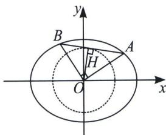

## 二、点 $P(x_0, y_0)$ 在圆锥曲线外的斜率和积为定值问题

之前提到的都是定点 $P(x_0, y_0)$ 在曲线上的模型，我们还是用椭圆来举例，将椭圆 $C$ 按向量 $\overrightarrow{PO}(-x_0, -y_0)$ 平移得椭圆 $C'$ : $\frac{(x + x_0)^2}{a^2} + \frac{(y + y_0)^2}{b^2} = 1$ ，又点 $P(x_0, y_0)$ 在椭圆 $\frac{x^2}{a^2} + \frac{y^2}{b^2} = 1$ 上，所以 $\frac{x_0^2}{a^2} + \frac{y_0^2}{b^2} = 1$ ，代入上式得 $\frac{x^2}{a^2} + \frac{y^2}{b^2} + \frac{2x_0}{a^2}x + \frac{2y_0}{b^2}y = 0$ ，我们发现这个二次式是没有常数项的，在构造齐次式的时候，我们仅仅需要 $\frac{x^2}{a^2} + \frac{y^2}{b^2} + \left(\frac{2x_0}{a^2}x + \frac{2y_0}{b^2}y\right)(mx + ny) = 0$ ，即在一次式乘以平移后的直线方程 $mx + ny$ ，定点 $P$ 不在圆锥曲线上时，我们会发现化简后常数项不为零，我们仅仅需要将这个不为零的常数项乘以 $(mx + ny)^2$ 即可.

1. 以原点为公共顶点的内切圆问题

已知椭圆 $\frac{x^{2}}{a^{2}}+\frac{y^{2}}{b^{2}}=1(a>b>0)$ ，O为坐标原点，AB为椭圆上的两动点，且 $OA\perp OB$ ，则原点到AB的距离 $d=|OH|$ 为定值： $\frac{1}{d^{2}}=\frac{1}{a^{2}}+\frac{1}{b^{2}}$ .

证明：设 $AB: mx + ny = 1$ ，则 $\frac{x^2}{a^2} + \frac{y^2}{b^2} = (mx + ny)^2$ ，即 $\frac{x^2}{a^2} - m^2 x^2 - 2mnxy + \frac{y^2}{b^2} - n^2 y^2 = 0$ ，当 $x \neq 0$ 时，两边除以 $x^2$ 得： $\left(\frac{1}{b^2} - n^2\right)\frac{y^2}{x^2} - 2mn\frac{y}{x} + \frac{1}{a^2} - m^2 = 0$ ，所以 $k_{OA}, k_{OB}$ 是这个关于 $\frac{y}{x}$ 的方程的两个根。

由于 $k_{OA} \cdot k_{OB} = -1$ ，所以 $\frac{\frac{1}{a^2} - m^2}{\frac{1}{b^2} - n^2} = -1$ ，即 $\frac{1}{a^2} + \frac{1}{b^2} = m^2 + n^2$ ，所以 $d^2 = \frac{1}{m^2 + n^2}$ ，即 $\frac{1}{d^2} = \frac{1}{a^2} + \frac{1}{b^2}$ 当 $x = 0$ 时， $AB: \frac{|x|}{a} + \frac{|y|}{b} = 1, \frac{1}{d^2} = \frac{1}{a^2} + \frac{1}{b^2}$ 一样成立.

![[高中/总复习/专题/2026版高中《mst老唐说题》圆锥曲线专题（数学）/上册/第07章_圆锥曲线常规数据处理方法/第一节_齐次化处理斜率和积问题/二_点_P_x_0__y_0__在圆锥曲线外的斜率和积为定值问题/例题/Q00048633.md]]
![[高中/总复习/专题/2026版高中《mst老唐说题》圆锥曲线专题（数学）/上册/第07章_圆锥曲线常规数据处理方法/第一节_齐次化处理斜率和积问题/二_点_P_x_0__y_0__在圆锥曲线外的斜率和积为定值问题/例题/Q00048634.md]]
![[高中/总复习/专题/2026版高中《mst老唐说题》圆锥曲线专题（数学）/上册/第07章_圆锥曲线常规数据处理方法/第一节_齐次化处理斜率和积问题/二_点_P_x_0__y_0__在圆锥曲线外的斜率和积为定值问题/例题/Q00048635.md]]
