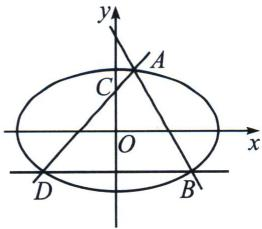
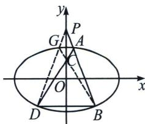

<!-- question-source:start -->
例7 (2024·北京)已知椭圆方程 $E: \frac{x^2}{a^2} + \frac{y^2}{b^2} = 1 (a > b > 0)$ , 以椭圆 $E$ 的焦点和短轴端点为顶点的四边形是边长为 2 的正方形. 过点 $(0, t)(t > \sqrt{2})$ 且斜率存在的直线与椭圆 $E$ 交于不同的两点 $A, B$ , 过点 $A$ 和 $C(0, 1)$ 的直线 $AC$ 与椭圆 $E$ 的另一个交点为 $D$ .

(1)求椭圆 E 的方程及离心率;

(2)若直线 BD 的斜率为 0，求 t 的值.

(1)椭圆方程 $C: \frac{x^2}{a^2} + \frac{y^2}{b^2} = 1 (a > b > 0)$ , 焦点和短轴端点构成边长为 2 的正方形, 则 $b = c = \frac{2}{\sqrt{2}} = \sqrt{2}$ , 故 $a^2 = b^2 + c^2 = 2$ , 解得 $a = \sqrt{2}$ ; $a = \sqrt{b^2 + c^2} = 2$ , 所以椭圆方程为 $\frac{x^2}{4} + \frac{y^2}{2} = 1$ , 离心率为 $e = \frac{\sqrt{2}}{2}$ ;

(2)解法一：设 $A(x_{1},y_{1})$ ， $B(x_{2},y_{2})$ ， $D(-x_ {2},y_{2})$ ， $P(0,t)$

由 A、C、D 三点共线可得： $\frac{y_{1}-1}{x_{1}}=\frac{y_{2}-1}{-x_{2}}\Rightarrow x_{1}y_{2}+x_{2}y_{1}=x_{2}+x_{1}①$

且 $y_{1}^{2}=2-\frac{x_{1}^{2}}{2}$ ， $y_{2}^{2}=2-\frac{x_{2}^{2}}{2}$ ②，又 $(x_{1}y_{2}-x_{2}y_{1})(x_{1}y_{2}+x_{2}y_{1})=x_{1}^{2}y_{2}^{2}-x_{2}^{2}y_{1}^{2}$ ，所以 $y_{1}x_{2}-y_{2}x_{1}=2(x_{1}-x_{2})$ 由 A、B、P 三点共线有： $\frac{y_{1}-t}{x_{1}}=\frac{y_{2}-t}{x_{2}}\rightarrow y_{1}x_{2}-y_{2}x_{1}=t(x_{1}-x_{2})$ ，所以 t=2.
<!-- question-source:end -->

![[高中/总复习/专题/2026版高中《mst老唐说题》圆锥曲线专题（数学）/上册/第07章_圆锥曲线常规数据处理方法/第一节_齐次化处理斜率和积问题/二_点_P_x_0__y_0__在圆锥曲线外的斜率和积为定值问题/例题/answers/Q00048635A1.md]]
