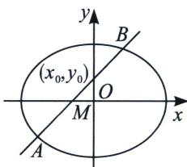

## 一、点差法与中点弦

若椭圆(双曲线)与直线 l 交于 AB 两点，其中 $A(x_{1}, y_{1})$ ， $B(x_{2}, y_{2})$ ， $M(x_{0}, y_{0})$ ，为 AB 中点，定理 1： $k_{AB} \cdot k_{OM} = -\frac{b^{2}}{a^{2}}$ （椭圆）； $k_{AB} \cdot k_{OM} = \frac{b^{2}}{a^{2}}$ （双曲线）

证明：设 $A(x_{1},y_{1})$ ， $B(x_{2},y_{2})$ ， $M(x_0,y_0)$ ，则

\(\begin{array}{r}\left\{\frac{x\_1^2}{a^2} +\frac{y\_1^2}{b^2} = 1① \right.\\ \left.\frac{x\_2^2}{a^2} +\frac{y\_2^2}{b^2} = 1② \right.\right.\\ \left.\frac{x\_1 + x\_2}{2} = x\_0③ \right.\right.\quad 双曲线： \(\left\{\frac{x\_1^2 - y\_1^2}{a^2} = 1① \right.\) \\ \left.\frac{y\_1 + y\_2}{2} = y\_0④ \right.\right.\quad \left.\frac{y\_1 + y\_2}{2} = y\_0④ \right.\) \\ \left.k\_{AB} = \frac{y\_2 - y\_1}{x\_2 - x\_1⑤}\right.\end{array}\)

①-②，并将③④⑤代入得： $k_{AB} \cdot k_{OM} = \frac{y_1 - y_2}{x_1 - x_2} \cdot \frac{y_1 + y_2}{x_1 + x_2} = \frac{y_1 - y_2}{x_1 - x_2} \cdot \frac{y_0}{x_0} = -\frac{b^2}{a^2}$ （椭圆）， $k_{AB} \cdot k_{OM} = \frac{y_1 - y_2}{x_1 - x_2} \cdot \frac{y_1 + y_2}{x_1 + x_2} = \frac{y_1 - y_2}{x_1 - x_2} \cdot \frac{y_0}{x_0} = \frac{b^2}{a^2}$ （双曲线）

点差法，抓住“差中斜”，这样找到了对应关系，由于点差法属于解析几何技巧方法的入门篇，第一次让大家见识到“设而不求”。本内容小题篇就已经介绍，写大题注意步骤即可，也不是什么难题。
