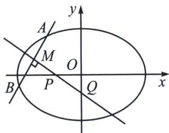

## 三、点差法与中垂线问题

如今的考试已经不可能让大家简单背个点差结论就能解决，总会在点差法的基础上加上一点命题逻辑，所以我们找到了常考的第一点——中垂线和对称问题！

中垂线问题: 若 $A 、 B$ 关于直线 $P Q$ 对称, 可以知道线段 $A B$ 被直线 $P Q$ 垂直平分, 其中 $P (n, 0)$ , $Q (0, m)$ 则能得出以下定理(不妨设焦点在 $x$ 轴上):

$m = -\frac{y_0c^2}{b^2}$ （椭圆）， $m = \frac{y_0c^2}{b^2}$ （双曲线）； $m = p + y_0$ （抛物线）；

$n=\frac{x_{0}c^{2}}{a^{2}}$ （椭圆）， $n=\frac{x_{0}c^{2}}{a^{2}}$ （双曲线）。 $n=p+x_{0}$ （抛物线）；

我们这里以焦点在 $x$ 轴上的椭圆为例来证明：

$k_{AB} \cdot k_{OM} = -\frac{b^{2}}{a^{2}}, k_{AB} \cdot k_{PQ} = -1, \frac{k_{OM}}{k_{PQ}} = \frac{b^{2}}{a^{2}}$ ，故 $\frac{\frac{y_{0}}{x_{0}}}{\frac{y_{0}-m}{x_{0}}} = \frac{b^{2}}{a^{2}}$ ，即 $m = -\frac{y_{0}c^{2}}{b^{2}}$ ；同理 $\frac{\frac{y_{0}}{x_{0}}}{\frac{y_{0}}{x_{0}-n}} = \frac{b^{2}}{a^{2}}$ ，即 $n = \frac{x_{0}c^{2}}{a^{2}}$ .

![[高中/总复习/专题/2026版高中《mst老唐说题》圆锥曲线专题（数学）/上册/第07章_圆锥曲线常规数据处理方法/第三节_点差法与中垂线问题/三_点差法与中垂线问题/例题/Q00053052.md]]
![[高中/总复习/专题/2026版高中《mst老唐说题》圆锥曲线专题（数学）/上册/第07章_圆锥曲线常规数据处理方法/第三节_点差法与中垂线问题/三_点差法与中垂线问题/例题/Q00053053.md]]
![[高中/总复习/专题/2026版高中《mst老唐说题》圆锥曲线专题（数学）/上册/第07章_圆锥曲线常规数据处理方法/第三节_点差法与中垂线问题/三_点差法与中垂线问题/例题/Q00053054.md]]
![[高中/总复习/专题/2026版高中《mst老唐说题》圆锥曲线专题（数学）/上册/第07章_圆锥曲线常规数据处理方法/第三节_点差法与中垂线问题/三_点差法与中垂线问题/例题/Q00048655.md]]
![[高中/总复习/专题/2026版高中《mst老唐说题》圆锥曲线专题（数学）/上册/第07章_圆锥曲线常规数据处理方法/第三节_点差法与中垂线问题/三_点差法与中垂线问题/例题/Q00048656.md]]
![[高中/总复习/专题/2026版高中《mst老唐说题》圆锥曲线专题（数学）/上册/第07章_圆锥曲线常规数据处理方法/第三节_点差法与中垂线问题/三_点差法与中垂线问题/例题/Q00053055.md]]
![[高中/总复习/专题/2026版高中《mst老唐说题》圆锥曲线专题（数学）/上册/第07章_圆锥曲线常规数据处理方法/第三节_点差法与中垂线问题/三_点差法与中垂线问题/例题/Q00053056.md]]
