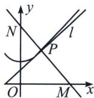

<!-- question-source:start -->
例5 (2024·郑州一模)已知点 $A$ 是双曲线 $C: \frac{y^2}{4} - \frac{x^2}{2} = 1$ 的上顶点.

## 高中数学 新思路 圆锥曲线专题

(1)若点 B 的坐标为 $(\sqrt{2}, 1)$ ，延长 AB 交双曲线于点 D，求点 D 的坐标；

(2)双曲线 C 与直线 l: $y=kx+m(k\neq\pm2)$ 有唯一的公共点 P，过点 P 且与 l 垂直的直线分别交 x 轴，y 轴于 $M(x,0)$ ， $N(0,y)$ 两点，当点 P 运动时，求点 $Q(x,y)$ 的轨迹方程.

(1)由题意得 $A(0,2)$ ，故直线 $AB$ 方程为 $\frac{y - 1}{2 - 1} = \frac{x - \sqrt{2}}{0 - \sqrt{2}}$ ，即 $x + \sqrt{2} y - 2\sqrt{2} = 0$

联立 $x + \sqrt{2} y - 2\sqrt{2} = 0$ 与 $C: \frac{y^2}{4} - \frac{x^2}{2} = 1$ ，得 $-3y^2 + 16y - 20 = 0$ ，由韦达定理得 $2y_D = \frac{20}{3}$ ，解得 $y_D = \frac{10}{3}$ ，故 $x_D = 2\sqrt{2} - \sqrt{2} y_D = -\frac{4\sqrt{2}}{3}$ ，则点 $D$ 的坐标为 $\left(-\frac{4\sqrt{2}}{3}, \frac{10}{3}\right)$ ；

(1)联立 $l: y = kx + m (k \neq \pm \sqrt{2})$ 与 $C: \frac{y^2}{4} - \frac{x^2}{2} = 1$ ，得 $(k^2 - 2)x^2 + 2kmx + m^2 - 4 = 0$ ， $k \neq \pm \sqrt{2}$ ，由 $\triangle = 4k^2m^2 - 4(k^2 - 2)(m^2 - 4) = 0$ ，解得 $2k^2 + m^2 = 4$ ，则 $m \neq 0$ ，又 $x_P = \frac{-km}{k^2 - 2} = \frac{-km}{-\frac{m^2}{2}} = \frac{2k}{m}$ ，

$y_{P}=k\cdot\frac{2k}{m}+m=\frac{2k^{2}+m^{2}}{m}=\frac{4}{m}$ ，故 $P\left(\frac{2k}{m},\frac{4}{m}\right)$ ，由题可知 $k\neq0$ ，过点P且与l垂直的直线方程为 $y-\frac{4}{m}=-\frac{1}{k}\left(x-\frac{2k}{m}\right)$ ，即 $y=-\frac{1}{k}x+\frac{6}{m}$ ，令x=0，得 $y=\frac{6}{m}$ ，令y=0，得 $x=\frac{6k}{m}$ ，

因为 $y=\frac{6}{m}$ ，所以 $m=\frac{6}{y}$ ，故 $k=\frac{mx}{6}=\frac{6}{y}\cdot\frac{x}{6}=\frac{x}{y}$ ，显然 $y\neq0$ ，代入 $2k^{2}+m^{2}=4$ 中，得 $2\frac{x^{2}}{y^{2}}+\frac{36}{y^{2}}=4$ ，化简得 $2y^{2}-x^{2}=18$ ，即 $\frac{y^{2}}{9}-\frac{x^{2}}{18}=1(y\neq0)$ .
<!-- question-source:end -->

![[高中/总复习/专题/2026版高中《mst老唐说题》圆锥曲线专题（数学）/上册/第07章_圆锥曲线常规数据处理方法/第三节_点差法与中垂线问题/三_点差法与中垂线问题/例题/answers/Q00048649A1.md]]
