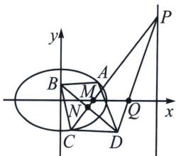

<!-- question-source:start -->
例6 (2024 北京海淀二模改篇题(25 届陪跑课学员张梦凯提问))已知椭圆 $E$ 的焦点在 $x$ 轴上, 中心在坐标原点. 以 $E$ 的一个顶点和两个焦点为顶点的三角形是等边三角形, 且其周长为 $6 \sqrt{2}$ .

(1)求椭圆 E 的方程;

(2)设过点 $M(2,0)$ 的直线 $l$ 与椭圆 $E$ 交于不同的两点 $A, C$ , 与直线 $x = 16$ 交于点 $P$ . 点 $B$ 在 $y$ 轴上, $D$ 为坐标平面内的一点, 四边形ABCD是菱形.

(i) 求 $\left| OB \right|$ 最大值；

(ii) 求证: 直线 $PD$ 过定点.

(1)因为椭圆 $E$ 的焦点在 $x$ 轴上, 中心在坐标原点, 不妨设椭圆 $E$ 的方程为 $\frac{x^2}{a^2} + \frac{y^2}{b^2} = 1 (a > b > 0)$ , 因为以 $E$ 的一个顶点和两个焦点为顶点的三角形是等边三角形, 且其周长为 $6\sqrt{2}$ , 所以 $2a + 2c = 6\sqrt{2}$ 且 $\frac{c}{a} = \frac{1}{2}$ , ①, 又 $a^2 = b^2 + c^2$ , ②, 联立①②, 解得 $a = 2\sqrt{2}$ , $b = \sqrt{6}$ , $c = \sqrt{2}$ , 则椭圆 $E$ 的方程为 $\frac{x^2}{8} + \frac{y^2}{6} = 1$ ;

(2)(i)令 $AC: y = k(x - 2)$ , $AC$ 中点 $N(x_0, y_0)$ , 利用点差法(省略)可得 $k_{ON}k_{AC} = -\frac{3}{4}$ ①, 且利用菱形性质可知 $k_{BN}k_{AC} = -1$ ②, ① $\div$ ②得: $\frac{k_{ON}}{k_{BN}} = \frac{3}{4} = \frac{y_0}{y_0 - y_B}$ , 所以 $y_B = -\frac{y_0}{3}$ ,

由于 $\left\{\begin{aligned}y_{0}&=k(x_{0}-2)\\ k&=-\frac{3x_{0}}{4y_{0}}\end{aligned}\right.$ 得： $y_{0}^{2}=-\frac{3}{4}(x_{0}^{2}-2x_{0})$ ，所以 $\frac{(x_{0}-1)^{2}}{3}+\frac{4y_{0}^{2}}{9}=1$ ， $-\frac{3}{2}\leqslant y_{0}\leqslant\frac{3}{2}$ ，所以 $\left|y_{B}\right|_{\max}=\frac{1}{2}$

(ii) 解法一：证明：不妨设直线 $l$ 的方程为 $x = ty + 2, A(x_{1}, y_{1}), C(x_{2}, y_{2})$ ，令 $x = 16$
<!-- question-source:end -->

![[高中/总复习/专题/2026版高中《mst老唐说题》圆锥曲线专题（数学）/上册/第07章_圆锥曲线常规数据处理方法/第三节_点差法与中垂线问题/三_点差法与中垂线问题/例题/answers/Q00048650A1.md]]
