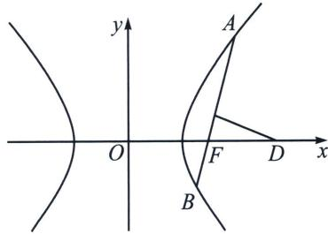

<!-- question-source:start -->
例8 (2024·广东模拟)已知双曲线 $\frac{x^{2}}{a^{2}}-\frac{y^{2}}{b^{2}}=1(a>0,b>0)$ 的右焦点为F，过点F且斜率为 $k(k\neq0)$ 的直线l交双曲线于A、B两点，线段AB的中垂线交x轴于点D．若 $|AB|\geqslant\sqrt{3}|DF|$ ，则双曲线的离心率取值范围是( )

A. $\left(1,\frac{2\sqrt{3}}{3}\right]$ B. $(1,\sqrt{3}]$ C. $[\sqrt{3},+\infty)$ D. $\left[\frac{2\sqrt{3}}{3},+\infty\right)$

<!-- question-source:end -->

![[高中/总复习/专题/2026版高中《mst老唐说题》圆锥曲线专题（数学）/上册/第07章_圆锥曲线常规数据处理方法/第三节_点差法与中垂线问题/三_点差法与中垂线问题/例题/answers/Q00048655A1.md]]
