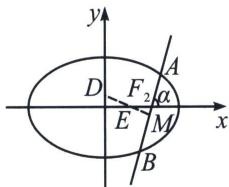

<!-- question-source:start -->
例10 (2024·鼓楼模拟)已知椭圆 $C: \frac{x^2}{a^2} + \frac{y^2}{b^2} = 1 (a > b > 0)$ , 长轴为 4, 不过坐标原点 $O$ 且不平行于坐标轴的直线 l 与椭圆 C 有两个交点 A, B, 线段 AB 的中点为 M, 直线 OM 的斜率与直线 l 的斜率的乘积为定值 $-\frac{1}{4}$ .

(1)求椭圆 C 的方程;

(2)若直线 l 过右焦点 $F_{2}$ ，问 y 轴上是否存在点 D，使得三角形 ABD 为正三角形，若存在，求出点 D 坐标，若不存在，请说明理由.

(1)由题意可知, $2a = 4$ , $a = 2$ . 设点 $A(x_{1}, y_{1})$ , $B(x_{2}, y_{2})$ , $A$ , $B$ 在椭圆上, 所以 $\frac{x_{1}^{2}}{a^{2}} + \frac{y_{1}^{2}}{b^{2}} = 1$ , $\frac{x_{2}^{2}}{a^{2}} + \frac{y_{2}^{2}}{b^{2}} = 1$ , 所以 $\frac{(x_{1} + x_{2})(x_{1} - x_{2})}{a^{2}} + \frac{(y_{1} + y_{2})(y_{1} - y_{2})}{b^{2}} = 0$ , 所以 $\frac{(y_{1} + y_{2})(y_{1} - y_{2})}{(x_{1} + x_{2})(x_{1} - x_{2})} = -\frac{a^{2}}{b^{2}}$ , 因为 $k_{AB} \cdot k_{OM} = -\frac{1}{4}$ , 所以 $\frac{y_{2} - y_{1}}{x_{2} - x_{1}} \cdot \frac{y_{2} + y_{1}}{x_{2} + x_{1}} = -\frac{1}{4}$ , 所以 $-\frac{b^{2}}{a^{2}} = -\frac{1}{4}$ , 所以 $b^{2} = 1$ , 所以椭圆 $C$ 方程为 $\frac{x^{2}}{4} + y^{2} = 1$ .

(2)令 $AB$ 中点 $M$ , $DM$ 交 $x$ 轴于 $E$ : 先证 $\frac{|EF_2|}{|AB|} = \frac{e}{2} = \frac{\sqrt{3}}{4}$ (请读者自己完成), $|AB| = \frac{4}{1 + 3\sin^2\alpha}$ , $|EF_2| = \frac{\sqrt{3}}{1 + 3\sin^2\alpha}$ ; 拆分中垂线, 乘除各一边, $|EM| = |EF_2|\sin \alpha$ , $|DE| = \frac{|OE|}{\sin\alpha} = \frac{\sqrt{3} - |EF_2|}{\sin\alpha}$ ; $|DM| = \frac{\sqrt{3}}{2}|AB|$ , 所以 $\frac{\sqrt{3}\sin\alpha}{1 + 3\sin^2\alpha} + \frac{\sqrt{3} - \frac{\sqrt{3}}{1 + 3\sin^2\alpha}}{\sin\alpha} = \frac{2\sqrt{3}}{1 + 3\sin^2\alpha}$ ; 所以 $\sin \alpha = \frac{1}{2}$ , 所以 $|EF_2| = \frac{4\sqrt{3}}{7}$ , $|OE| = \sqrt{3} - \frac{4\sqrt{3}}{7} = \frac{3\sqrt{3}}{7}$ , 所以 $|OD| = \frac{9}{7}$ , 故 $D(0, \pm \frac{9}{7})$ .
<!-- question-source:end -->

![[高中/总复习/专题/2026版高中《mst老唐说题》圆锥曲线专题（数学）/上册/第07章_圆锥曲线常规数据处理方法/第三节_点差法与中垂线问题/三_点差法与中垂线问题/例题/answers/Q00048657A1.md]]
