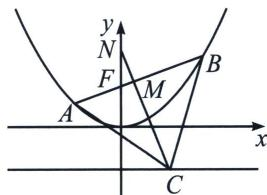

> [!faq]- 《圆锥曲线专题(上册)》例题解析
>
> > [!success]- **【答案】** B
>
> > [!note]- **【分析】**
> > 本题未单列分析。
>
> > [!note]- **【解析】**
> > 解析 如图，作 $AB$ 的中垂线交 $y$ 轴于 $N$ ， $AB$ 中点为 $M$ ，令 $AB$ 与 $y$ 轴夹角为 $\alpha$
> > $$
> > \left| A B \right| = \frac {4}{\sin^ {2} \alpha}, \left| N F \right| = \frac {1}{2} \left| A B \right| = \frac {2}{\sin^ {2} \alpha}, \left| N C \right| = \frac {\left| N F \right| + p}{\sin \alpha} = \frac {\frac {2}{\sin^ {2} \alpha} + 2}{\sin \alpha}, \left| M N \right| = \left| N F \right| \sin \alpha = \frac {2}{\sin \alpha},
> > $$
> > $|MN|+|MC|=|NC|$ ， $|MC|=\frac{\sqrt{3}}{2}|AB|=\frac{2\sqrt{3}}{\sin^{2}\alpha}$ ，所以 $\sin\alpha=\frac{\sqrt{3}}{3}$ ， $|AB|=12$ ，故选 B.
> > 
