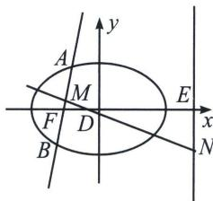
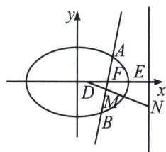

> [!faq]- 《圆锥曲线专题(上册)》例题解析
>
> > [!success]- **【答案】** 详见解析
>
> > [!note]- **【分析】**
> > 本题未单列分析。
>
> > [!note]- **【解析】**
> > 解析
> > 解决口诀：截距两边分，乘除各一边！
> > 模型一：正向相加型
> > 
> > 如图: $AB$ 为过椭圆 $\frac{x^{2}}{a^{2}}+\frac{y^{2}}{b^{2}}=1(a>b>0)$ 的左焦点 $F$ 的直线, $MN$ 为 $AB$ 中垂线, $M$ 为 $AB$ 中点, $N$ 在直线 $x=n$ 上, $D$ 为 $MN$ 与 $x$ 轴的交点, $E(n,0)$ , 易知 $|FD|=\frac{e}{2}|AB|$ , $\angle AFD=\alpha$ , $|AB|=\frac{2ab^{2}}{b^{2}+c^{2}\sin^{2}\alpha}$ ,
> > $|MD|=|FD|\cdot\sin\alpha=\frac{c}{2a}\cdot\frac{2ab^{2}\sin\alpha}{b^{2}+c^{2}\cdot\sin^{2}\alpha}=\frac{b^{2}c\sin\alpha}{b^{2}+c^{2}\cdot\sin^{2}\alpha}$ ①， $|DN|=\frac{|ED|}{\sin\alpha}=\frac{n+c-|FD|}{\sin\alpha}=$ $\frac{n+c-\frac{b^{2}c}{b^{2}+c^{2}\cdot\sin^{2}\alpha}}{\sin\alpha}$ ②,
> > 所以 $|MN| = |MD| + |DN| = |FD|\sin \alpha +\frac{|EF| - |FD|}{\sin\alpha}$ （①②代入整理即可）
> > 模型二：反向相减型
> > 
> > 如图：AB 为过椭圆 $\frac{x^{2}}{a^{2}} + \frac{y^{2}}{b^{2}} = 1 (a > b > 0)$ 的右焦点 F 的直线，MN 为 AB 中垂线，M 为 AB 中点，N 在直线 $x = n (n > c)$ 上，D 为 MN 与 x 轴的交点， $E(n, 0)$ 易知： $|FD| = \frac{e}{2} |AB|$ ， $\angle AFD = \alpha$ ， $|AB| = \frac{2ab^{2}}{b^{2} + c^{2}\sin^{2}\alpha}$ ， $|MD| = |FD| \cdot \sin\alpha = \frac{e}{2} \cdot |AB| \sin\alpha$ ， $|DN| = \frac{|ED|}{\sin\alpha} = \frac{n - c + \frac{e}{2} |AB|}{\sin\alpha}$ ， $|MN|=|ND|-|MD|=\frac{n-c+\frac{e}{2}|AB|}{\sin\alpha}-\frac{e}{2}\cdot|AB|\sin\alpha.$
