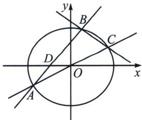
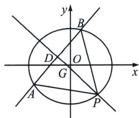
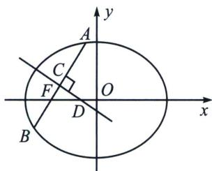
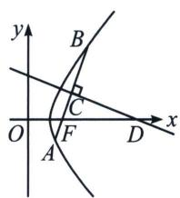
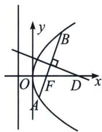

> [!faq]- 《圆锥曲线专题(上册)》例题解析
>
> > [!success]- **【答案】** 详见解析
>
> > [!note]- **【解析】**
> > 解析 (1)由已知得， $\left\{ \begin{array}{l} \frac{c}{a} = \frac{1}{2} \\ a = 2 \\ b^2 = a^2 - c^2 \end{array} \right.$ ，解得 $\left\{ \begin{array}{l} a = 2 \\ b = \sqrt{3} \end{array} \right.$ ，则椭圆 $W$ 的方程为 $\frac{x^2}{4} + \frac{y^2}{3} = 1$ ；
> >
> > (2)(i)证明：依题意可设点 $A(x_{1},y_{1})$ ， $B(x_{2},y_{2})$ ，且 $x_{1}\neq x_{2}$ ，
> >
> > 因为点 A 关于原点的对称点为 C，所以 $C(-x_{1}, -y_{1})$ ，因为点 A，B 在 W 上，所以 $\left\{\begin{aligned}\frac{x_{1}^{2}}{4}+\frac{y_{1}^{2}}{3}&=1\\ \frac{x_{2}^{2}}{4}+\frac{y_{2}^{2}}{3}&=1\end{aligned}\right.$ ，作差得 $\frac{y_{2}^{2}-y_{1}^{2}}{x_{2}^{2}-x_{1}^{2}}=-\frac{3}{4}$ ，因为直线 AB： $x-my+1=0(m\neq0)$ 的斜率为 $\frac{1}{m}$ ，直线 BC 的斜率为 k，所以 $\frac{k}{m}=\frac{y_{2}-y_{1}}{x_{2}-x_{1}}\cdot\frac{y_{2}+y_{1}}{x_{2}+x_{1}}=\frac{y_{2}^{2}-y_{1}^{2}}{x_{2}^{2}-x_{1}^{2}}=-\frac{3}{4}$ ，即 $\frac{k}{m}$ 为定值 $-\frac{3}{4}$ ;
> >
> > 
> >
> > 
> >
> > ( ii )(求隐藏轨迹): 设弦 $AB$ 的中点 $D$ 的坐标为 $(x_{D}, y_{D})$ , 点 $P$ 的坐标为 $(x_{P}, y_{P})$ , $\triangle PAB$ 的重心 $G$ 的坐标为 $(x_{G}, y_{G})$ , 利用点差法得 $k_{OD} k_{AB} = -\frac{3}{4}$ , 且 $k_{AB} = \frac{y_{D}}{x_{D} + 1}$ , 所以 $D$ 坐标 $(x_{D}, y_{D})$ 的轨迹方程为 $3(x_{D}^{2} + x_{D}) + 4y_{D}^{2} = 0①$ , 再利用 $\left\{ \begin{array}{l} k_{OD} k_{AB} = -\frac{3}{4} \\ k_{GD} k_{AB} = -1 \end{array} \right.$ , 两式相除得: $y_{G} = -\frac{y_{D}}{3}$ , 由于 $PAB$ 的重心 $G$ 在 $y$ 轴上, 所以 $\overrightarrow{PG} = 2 \overrightarrow{GD}$ , 所以 $y_{P} - y_{G} = 2 (y_{G} - y_{D}) \Rightarrow y_{P} = -3y_{D}$ , 同理 $x_{P} = -2x_{D}$ , 由于 $P$ 在 $W$ 上, 所以 $\frac{4x_{D}^{2}}{4} + \frac{9y_{D}^{2}}{3} = 1②$ , ①②联立得: $x_{D} = -\frac{4}{5}$ 或 $x_{D} = -1$ (舍), $y_{D} = \pm \frac{\sqrt{3}}{5}$ , 所以 $k_{AB} = \frac{y_{D}}{x_{D} + 1} = \pm \sqrt{3}$ , 直线 $AB$ 的方程为 $3x \pm \sqrt{3}y + 3 = 0$ . 四、焦点弦中垂线特殊性质
> >
> > 1. 设椭圆焦点弦 $AB$ 的中垂线与长轴的交点为 $D$ , 则 $\left|FD\right| = \frac{e}{2}\left|AB\right|$ (如左图)
> >
> > 
> >
> > 
> >
> > 
> >
> > 2. 设双曲线焦点弦 $AB$ 的中垂线与焦点所在轴的交点为 $D$ , 则 $\left|FD\right| = \frac{e}{2}\left|AB\right|$ (如中图)
> >
> > 3. 设抛物线焦点弦 $AB$ 的中垂线与对称轴的交点为 $D$ , 则 $|FD| = \frac{1}{2} |AB|$ (如右图)
> >
> > (1)证明：根据椭圆焦长公式： $|BF|=\frac{b^{2}}{a-c\cos\alpha}$ ， $|AF|=\frac{b^{2}}{a+c\cos\alpha}$ ， $|AB|=\frac{2ab^{2}}{a^{2}-c^{2}\cos^{2}\alpha}$
> >
> > $$
> > | C F | = \left| \frac {| A B |}{2} - | A F | \right| = \left| \frac {| A F | + | B F |}{2} - | A F | \right| = \left| \frac {| B F | - | A F |}{2} \right| = \left| \frac {\frac {b ^ {2}}{a - c \cos \alpha} - \frac {b ^ {2}}{a + c \cos \alpha}}{2} \right| = \frac {b ^ {2} c | \cos \alpha |}{a ^ {2} - c ^ {2} \cos^ {2} \alpha},
> > $$
> >
> > $|DF|=\frac{|CF|}{|\cos\alpha|}=\frac{b^{2}c}{a^{2}-c^{2}\cos^{2}\alpha}$ ，故 $\frac{|DF|}{|AB|}=\frac{b^{2}c}{2ab^{2}}=\frac{c}{2a}=\frac{e}{2}$
> >
> > (2)证明: 当直线 $AB$ 与双曲线交于一支时, 证明过程同椭圆一致; 当直线 $AB$ 与双曲线交于两支时,
> >
> > $|BF|=\frac{b^{2}}{c\cos\alpha-a},\quad|AF|=\frac{b^{2}}{c\cos\alpha+a},\quad|AB|=\frac{2ab^{2}}{c^{2}\cos^{2}\alpha-a^{2}},\quad|CF|=\frac{b^{2}c\cos\alpha}{c^{2}\cos^{2}\alpha-a^{2}}$ ，其余过程与椭圆一致.
> >
> > (3)证明：抛物线 $y^{2}=2px$ (p>0)焦点弦公式： $|AF|=\frac{p}{1+\cos\alpha}$ ; $|BF|=\frac{p}{1-\cos\alpha}$ ; $|AB|=\frac{2p}{\sin^{2}\alpha}$ . $|CF|=\left|\frac{|AB|}{2}-|AF|\right|=\left|\frac{|AF|+|BF|}{2}-|AF|\right|=\left|\frac{|BF|-|AF|}{2}\right|=\frac{p|\cos\alpha|}{\sin^{2}\alpha}$ , $|DF|=\frac{|CF|}{|\cos\alpha|}=\frac{p}{\sin^{2}\alpha}$ , 故 $\left|\frac{DF}{AB}\right|=\frac{1}{2}$ .
> >
> > 如果是直接问 $|DF|$ 与 $|AB|$ 之间的长度关系，那属于之前相对简单的考题，本文论述一下在这个结论下隐藏的命题逻辑.
> >
> > 关于焦点弦和中垂线比值问题：求焦点弦所在的直线方程，中垂线被长轴(对称轴)分成两段，
> >
> > 解决口诀：截距两边分，乘除各一边！
> >
> > 模型一：正向相加型
> >
> > 
> >
> > 如图: $AB$ 为过椭圆 $\frac{x^{2}}{a^{2}}+\frac{y^{2}}{b^{2}}=1(a>b>0)$ 的左焦点 $F$ 的直线, $MN$ 为 $AB$ 中垂线, $M$ 为 $AB$ 中点, $N$ 在直线 $x=n$ 上, $D$ 为 $MN$ 与 $x$ 轴的交点, $E(n,0)$ , 易知 $|FD|=\frac{e}{2}|AB|$ , $\angle AFD=\alpha$ , $|AB|=\frac{2ab^{2}}{b^{2}+c^{2}\sin^{2}\alpha}$ ,
> >
> > $|MD|=|FD|\cdot\sin\alpha=\frac{c}{2a}\cdot\frac{2ab^{2}\sin\alpha}{b^{2}+c^{2}\cdot\sin^{2}\alpha}=\frac{b^{2}c\sin\alpha}{b^{2}+c^{2}\cdot\sin^{2}\alpha}$ ①， $|DN|=\frac{|ED|}{\sin\alpha}=\frac{n+c-|FD|}{\sin\alpha}=$ $\frac{n+c-\frac{b^{2}c}{b^{2}+c^{2}\cdot\sin^{2}\alpha}}{\sin\alpha}$ ②,
> >
> > 所以 $|MN| = |MD| + |DN| = |FD|\sin \alpha +\frac{|EF| - |FD|}{\sin\alpha}$ （①②代入整理即可）
> >
> > 模型二：反向相减型
> >
> > 
> >
> > 如图：AB 为过椭圆 $\frac{x^{2}}{a^{2}} + \frac{y^{2}}{b^{2}} = 1 (a > b > 0)$ 的右焦点 F 的直线，MN 为 AB 中垂线，M 为 AB 中点，N 在直线 $x = n (n > c)$ 上，D 为 MN 与 x 轴的交点， $E(n, 0)$ 易知： $|FD| = \frac{e}{2} |AB|$ ， $\angle AFD = \alpha$ ， $|AB| = \frac{2ab^{2}}{b^{2} + c^{2}\sin^{2}\alpha}$ ， $|MD| = |FD| \cdot \sin\alpha = \frac{e}{2} \cdot |AB| \sin\alpha$ ， $|DN| = \frac{|ED|}{\sin\alpha} = \frac{n - c + \frac{e}{2} |AB|}{\sin\alpha}$ ， $|MN|=|ND|-|MD|=\frac{n-c+\frac{e}{2}|AB|}{\sin\alpha}-\frac{e}{2}\cdot|AB|\sin\alpha.$
