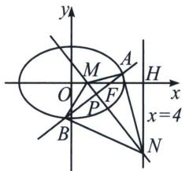

> [!faq]- 《圆锥曲线专题(上册)》例题解析
>
> > [!success]- **【答案】** 详见解析
>
> > [!note]- **【解析】**
> > 解析 (1)证明：依题意有 $F(2,0)$ ，直线 $l$ 过点 $F$ ，且斜率存在，则设直线 $l$ 方程为 $y = k(x - 2)$ ，设 $A(x_{1},y_{1})$ ， $B(x_{2},y_{2})$ ，联立 $\left\{ \begin{array}{l} y = k(x - 2) \\ \frac{x^{2}}{8} + \frac{y^{2}}{4} = 1 \end{array} \right.$ ，消去 $y$ 并整理得 $(1 + 2k^{2})x^{2} - 8k^{2}x + 8k^{2} - 8 = 0$ ，
> >
> > 因为 $l$ 过椭圆右焦点 $F$ ，所以 $l$ 一定与椭圆相交，即 $\triangle > 0$ 恒成立。所以 $x_{1} + x_{2} = \frac{8k^{2}}{1 + 2k^{2}}$ ， $x_{1}x_{2} = \frac{8k^{2} - 8}{1 + 2k^{2}}$ ， $y_{1}y_{2} = k(x_{1} - 2) \cdot k(x_{2} - 2) = k^{2}[x_{1}x_{2} - 2(x_{1} + x_{2}) + 4] = k^{2}\left(\frac{8k^{2} - 8}{1 + 2k^{2}} - \frac{16k^{2}}{1 + 2k^{2}} + \frac{4 + 8k^{2}}{1 + 2k^{2}}\right) = \frac{-4k^{2}}{1 + 2k^{2}}$ ，设 $C(m, 0)$ ，则 $\overrightarrow{CA} = (x_{1} - m, y_{1})$ ， $\overrightarrow{CB} = (x_{2} - m, y_{2})$ ， $\overrightarrow{CA} \cdot \overrightarrow{CB} = (x_{1} - m)(x_{2} - m) + y_{1}y_{2} = x_{1}x_{2} -$
> >
> > $$
> > m \left(x _ {1} + x _ {2}\right) + m ^ {2} + y _ {1} y _ {2} = \frac {8 k ^ {2} - 8}{1 + 2 k ^ {2}} - \frac {8 m k ^ {2}}{1 + 2 k ^ {2}} + \frac {m ^ {2} + 2 m ^ {2} k ^ {2}}{1 + 2 k ^ {2}} + \frac {- 4 k ^ {2}}{1 + 2 k ^ {2}} = \frac {(4 - 8 m + 2 m ^ {2}) k ^ {2} + (m ^ {2} - 8)}{1 + 2 k ^ {2}}
> > $$
> >
> > 要使 $\overrightarrow{CA}\cdot\overrightarrow{CB}$ 为定值，则 $4-8m+2m^{2}=2(m^{2}-8)$ ，解得 $m=\frac{5}{2}$ ，此时 $\overrightarrow{CA}\cdot\overrightarrow{CB}=-\frac{7}{4}$ ，
> > 所以在 x 轴上存在点 $C\left(\frac{5}{2},0\right)$ ，使 $\overrightarrow{CA}\cdot\overrightarrow{CB}$ 为定值，定值为 $-\frac{7}{4}$ .
> >
> > 
> >
> > (2)设 $AB$ 倾斜角为 $\alpha$ ，先证 $\frac{|MF|}{|AB|} = \frac{e}{2} = \frac{\sqrt{2}}{4}$ （请读者自己完成）， $|AB| = \frac{4\sqrt{2}}{1 + \sin^2\alpha}$ ， $|MF| = \frac{2}{1 + \sin^2\alpha}$ ；拆分中垂线， $AB$ 中点 $P$ ，乘除各一边， $|PM| = |MF| \sin \alpha = \frac{2\sin\alpha}{1 + \sin^2\alpha}$ ，
> >
> > $|PN|=\frac{|MH|}{\sin\alpha}-|PM|=\frac{2+|MF|}{\sin\alpha}-|PM|=\frac{4}{\sin\alpha(1+\sin^{2}\alpha)}$ ; 所以 $|PM|\cdot|PN|=\frac{8}{(1+\sin^{2}\alpha)^{2}}=\frac{1}{4}$ $|AB|^{2}$ ，由相交弦定理得，A，M，B，N四点共圆.
