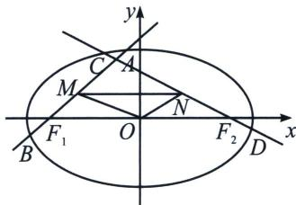
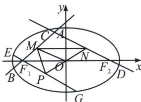

<!-- question-source:start -->
例2 (2025·临近一模(25陪跑课学员刘自豪提问))已知椭圆 $E: \frac{x^2}{a^2} + \frac{y^2}{b^2} = 1 (a > 0, b > 0)$ 的离心率为 $\frac{\sqrt{6}}{3}, F_1, F_2$ 是 $E$ 的左、右焦点，且 $|F_1F_2| = 4\sqrt{2}$ ，直线 $l_2$ 过点 $F_1$ 与 $E$ 交于 $A, B$ 两点.

(1)求 $E$ 的方程;

(2)若 $|AB|=2\sqrt{3}$ ，求 $l_{1}$ 的方程；

(3)若直线 $l_{2}$ 过点 $F_{2}$ 与 $E$ 交于 $C, D$ 两点，且 $l_{1}, l_{2}$ 的斜率乘积为 $-\frac{1}{3}, M, N$ 分别是线段 $AB, CD$ 的中点，求 $\triangle OMN$ 面积的最大值.

(1)因为椭圆 $E$ 离心率为 $\frac{\sqrt{6}}{3}$ , $|F_1F_2| = 4\sqrt{2}$ , 所以 $\left\{ \begin{array}{l} \frac{c}{a} = \frac{\sqrt{6}}{3} \\ 2c = 4\sqrt{2} \\ a^2 = b^2 + c^2 \end{array} \right.$ , 解得 $a = 2\sqrt{3}$ , $b = 2$ ,

则椭圆 E 的方程为 $\frac{x^{2}}{12} + \frac{y^{2}}{4} = 1$ ;

(2)解法一: 当直线 $l_{1}$ 的斜率为零时, 此时直线 $y = 0$ 的方程为 $x = \pm 2 \sqrt{3}$ , 解得 $x = \pm 2 \sqrt{3}$ , 此时 $|AB| = 4 \sqrt{3}$ , 不符合题意, 所以直线 $l_{1}$ 的斜率存在, 设直线 $l_{1}$ 的方程为 $x = my - 2 \sqrt{2}$ , $A(x_{1}, y_{1})$ , $B(x_{2}, y_{2})$ ,

联立 $\left\{ \begin{array}{l} x = my - 2\sqrt{2} \\ \frac{x^2}{12} + \frac{y^2}{4} = 1 \end{array} \right.$ ，消去 $x$ 并整理得 $(m^2 + 3)y^2 - 4\sqrt{2}my - 4 = 0$ ，此时 $\Delta = (-4\sqrt{2}m)^2 + 16(m^2 + 3) > 0$

由韦达定理得 $y_{1} + y_{2} = \frac{4\sqrt{2}m}{m^{2} + 3}, y_{1}y_{2} = \frac{-4}{m^{2} + 3}$ ，

所以 $|AB| = \sqrt{1 + m^2} \cdot \sqrt{(y_1 + y_2)^2 - 2y_1y_2} = \sqrt{1 + m^2} \cdot \sqrt{\left(\frac{4\sqrt{2}m}{m^2 + 3}\right)^2 + \frac{16}{m^2 + 3}} = 2\sqrt{3}$ ，解得 $m = \pm 1$ ，

(3) 解法一：由
(2) 知 $y_{1} + y_{2} = \frac{4\sqrt{2}m}{m^{2} + 3}$ ，所以 $x_{1} + x_{2} = my_{1} - 2\sqrt{2} + my_{2} - 2\sqrt{2} = \frac{-12\sqrt{2}}{m^{2} + 3}$ ，即 $M\left(\frac{-6\sqrt{2}}{m^{2} + 3}, \frac{2\sqrt{2}m}{m^{2} + 3}\right)$ ，设直线 $l_{1}$ 的方程为 $x = ny + 2\sqrt{2}$ ， $C(x_{3}, y_{3})$ ， $D(x_{4}, y_{4})$ ，

联立 $\left\{ \begin{array}{l} x = ny + 2\sqrt{2} \\ \frac{x^2}{12} + \frac{y^2}{4} = 1 \end{array} \right.$ ，消去 $x$ 并整理得 $(n^2 + 3)y^2 + 4\sqrt{2}ny - 4 = 0$ ，此时 $\Delta = (-4\sqrt{2}n)^2 + 16(n^2 + 3) > 0$ 。由韦达定理得 $y_3 + y_4 = \frac{-4\sqrt{2}n}{n^2 + 3}$ ，所以 $x_3 + x_4 = ny_1 + 2\sqrt{2} + ny_2 + 2\sqrt{2} = \frac{12\sqrt{2}}{n^2 + 3}$ ，即 $N\left(\frac{6\sqrt{2}}{n^2 + 3}, \frac{-2\sqrt{2}n}{n^2 + 3}\right)$ ，因为 $l_2$ ， $l_2$ 的斜率乘积为 $-\frac{1}{3}$ ，所以 $\frac{1}{m} \cdot \frac{1}{n} = -\frac{1}{3}$ ，解得 $mn = -3$ ，即 $N\left(\frac{2\sqrt{2}m^2}{m^2 + 3}, \frac{2\sqrt{2}m}{m^2 + 3}\right)$ ，

显然边 $MN$ 与横轴平行，所以 $S_{\triangle OMN} = \frac{1}{2} \times \frac{2\sqrt{2}|m|}{m^2 + 3} \times \left|\frac{2\sqrt{2}m^2}{m^2 + 3} + \frac{6\sqrt{2}}{m^2 + 3}\right| = \frac{4}{|m| + \frac{3}{|m|}} \leqslant \frac{4}{2\sqrt{|m| \cdot \frac{3}{|m|}}}$ ，即 $S_{\triangle OMN} \leqslant \frac{2\sqrt{3}}{3}$ 当 $|m| = \frac{3}{|m|}$ 时，即 $m = \pm \sqrt{3}$ 时，等号成立。则 $\triangle OMN$ 面积的最大值 $\frac{2\sqrt{3}}{3}$ 。

<!-- question-source:end -->

![[高中/总复习/专题/2026版高中《mst老唐说题》圆锥曲线专题（数学）/上册/第07章_圆锥曲线常规数据处理方法/第三节_点差法与中垂线问题/二_点差法与隐藏的中点轨迹问题/例题/answers/Q00048646A1.md]]
