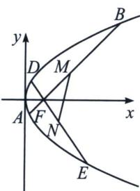
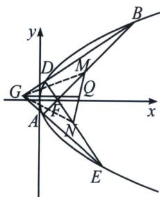

<!-- question-source:start -->
例4 (2024·九省联考)已知抛物线 $C: y^{2} = 4x$ 的焦点为 $F$ , 过 $F$ 的直线 $l$ 交 $C$ 于 $A, B$ 两点, 过 $F$ 与 $l$ 垂直的直线交 $C$ 于 $D, E$ 两点, 其中 $B, D$ 在 $x$ 轴上方, $M, N$ 分别为 $AB, DE$ 的中点.

(1)证明：直线 $MN$ 过定点；

(2)设 G 为直线 AE 与直线 BD 的交点，求 $\triangle GMN$ 面积的最小值.

(1)证明：由 $C: y^{2} = 4x$ ，故 $F(1, 0)$ ，由直线 $AB$ 与直线 $CD$ 垂直，故两只直线斜率都存在且不为 0，设 $A(x_{1}, y_{1})$ 、 $B(x_{2}, y_{2})$ 、 $M(x_{M}, y_{M})$ 、 $E(x_{3}, y_{3})$ 、 $D(x_{4}, y_{4})$ 、 $N(x_{N}, y_{N})$ ，

$k_{AB}=\frac{y_{2}-y_{1}}{x_{2}-x_{1}}=\frac{y_{2}-y_{1}}{\frac{y_{2}^{2}}{4}-\frac{y_{1}^{2}}{4}}=\frac{4}{y_{1}+y_{2}}=\frac{2}{y_{M}}$ ，且同时满足 $k_{AB}=\frac{y_{M}}{x_{M}-1}$ ，同理 $k_{CD}=\frac{2}{y_{N}}$ ，且同时满足 $k_{CD}=$ $\frac{y_{N}}{x_{N}-1},\left\{\begin{aligned}\frac{2}{y_{M}}\cdot\frac{y_{N}}{x_{N}-1}&=-1\\ \frac{y_{M}}{x_{M}-1}\cdot\frac{2}{y_{N}}&=-1\end{aligned}\right.\Rightarrow\left\{\begin{aligned}2y_{N}&=-x_{N}y_{M}+y_{M}\\ 2y_{M}&=-x_{M}y_{N}+y_{N}\end{aligned}\right.\Rightarrow x_{M}y_{N}-x_{N}y_{M}=3(y_{N}-y_{M})\Rightarrow MN$ 过点(3,0);

(2): 由
(1)知 $k_{AB} = \frac{4}{y_1 + y_2}$ , 直线 $AB$ 的方程为 $y = \frac{4}{y_1 + y_2} \left(x - \frac{y_1^2}{4}\right) + y_1$ , 即 $4x - (y_1 + y_2)y + y_1y_2 = 0$ , 又直线 $AB$ 过点 $F(1, 0)$ , 所以 $y_1y_2 = -4$ , 同理, $4x - (y_3 + y_4)y + y_3y_4 = 0$ , 又直线 $DE$ 过点 $F(1, 0)$ , 所以 $y_3y_4 = -4$ ,

直线 AE 的方程为 $4x-(y_{1}+y_{4})y+y_{1}y_{4}=0①$ ，直线 BD 的方程为 $4x-(y_{2}+y_{3})y+y_{2}y_{3}=0②$ ，

将直线 AE 的方程为 $4x-(y_{1}+y_{4})y+y_{1}y_{4}=0$ ，转化为 $4x-\left(\frac{-4}{y_{2}}+\frac{-4}{y_{3}}\right)y+\frac{16}{y_{2}y_{3}}=0$ ，

即 $(y_{2}+y_{3})y=-y_{2}y_{3}x-4$ ，和直线BD的方程 $(y_{2}+y_{3})y=4x+y_{2}y_{3}$ ，联立得：x=-1.

所以点 $G$ 的横坐标为 $-1$ ，即直线 $AE$ 与 $BD$ 的交点在定直线 $x = -1$ 上。由于 $\frac{2}{y_M} \cdot \frac{2}{y_N} = -1$ ，故 $y_N = \frac{-4}{y_M}$ ，且 $k_{AB} = \frac{2}{y_M} = \frac{y_M}{x_M - 1} \Rightarrow y_M^2 = 2x_M - 2$ ，同理 $y_N^2 = 2x_N - 2$ ，所以 $MN$ 轨迹方程为 $y^2 = 2x - 2$

过点 $G$ 作 $GQ \parallel x$ 轴，交直线 $MN$ 于点 $Q$ ，则 $S_{\triangle GMN} = \frac{1}{2} |y_M - y_N| \times |x_Q - x_G| = \frac{1}{2} \left|y_M + \frac{4}{y_M}\right| |x_Q + 1|$ ，故 $|y_M - y_N| \geqslant 2\sqrt{y_M \cdot \frac{4}{y_M}} = 4$ ，当且仅当 $y_M = 2$ 时等号成立，此时 $M(3, 2)$ ， $N(3, -2)$ ， $S_{\triangle GMN} = \frac{1}{2} \times 4 \times 4 = 8$ ，

下证 $S_{\triangle GMN} \geqslant 8$ ，即证 $|y_M - y_N| \geqslant 2\sqrt{y_M \cdot \frac{4}{y_M}} = 4, |x_Q + 1| \geqslant 4$ ，由抛物线的对称性，不妨设 $y_M > 0$ ，则 $y_N < 0$ ，当 $y_M > 2$ 时，有 $y_N \in (-2, 0)$ ，则点 $G$ 在 $x$ 轴上方，点 $Q$ 亦在 $x$ 轴上方，有 $k_{MN} = \frac{1}{y_M + y_N} > 0$ ，由直线 $MN$ 过定点 $(3, 0)$ ，此时 $|x_Q - x_G| > 3 - (-1) = 4$ ，同理，当 $y_M < 2$ 时，有点 $G$ 在 $x$ 轴下方，点 $Q$ 亦在 $x$ 轴下方，有 $\frac{1}{y_M + y_N} < 0$ ，故此时 $|x_Q - x_G| > 4$ ，

当且仅当 $y_{M} = 2$ 时， $x_{Q} = 3$ ，故 $|x_{Q} - x_{G}| \geqslant 4$ 恒成立，故 $S_{\triangle GMN} = \frac{1}{2} |y_{M} - y_{N}| \times |x_{Q} - x_{G}| \geqslant 8$ ，
<!-- question-source:end -->

![[高中/总复习/专题/2026版高中《mst老唐说题》圆锥曲线专题（数学）/上册/第07章_圆锥曲线常规数据处理方法/第三节_点差法与中垂线问题/二_点差法与隐藏的中点轨迹问题/例题/answers/Q00048648A1.md]]
