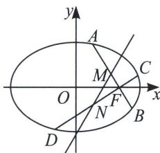

<!-- question-source:start -->
例1 已知椭圆 $\frac{x^{2}}{a^{2}} +\frac{y^{2}}{b^{2}} = 1(a > b > 0)$ 的右焦点 $F(1,0)$ , 离心率为 $\frac{\sqrt{2}}{2}$ , 过 $F$ 作两条互相垂直的弦 $AB$ , $CD$ , 设 $AB$ , $CD$ 的中点分别为 $M$ , $N$ .

(1)求椭圆的方程;

(2)证明：直线 MN 必过定点，并求出此定点坐标；

(3)若弦 AB, CD 的斜率均存在, 求 $\triangle FMN$ 面积的最大值.

<!-- question-source:end -->

![[高中/总复习/专题/2026版高中《mst老唐说题》圆锥曲线专题（数学）/上册/第07章_圆锥曲线常规数据处理方法/第三节_点差法与中垂线问题/二_点差法与隐藏的中点轨迹问题/例题/answers/Q00053048A1.md]]
