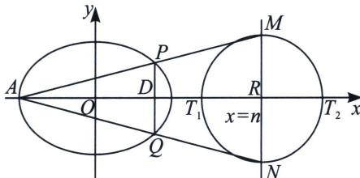

## 一、同轴轴点弦+顶点角隐藏的斜率之积

若以椭圆的左顶点 $A$ 作 $AP$ 、 $AQ$ 交椭圆于 $P$ 、 $Q$ 两点，且 $PQ$ 过 $x$ 轴上点 $D(m,0)$ ，延长 $AP$ 、 $AQ$ 交直线 $x=n$ 于 $M$ 、 $N$ 两点，以 $MN$ 为直径作圆，则圆在 $x$ 轴上交于两定点 $T_{1}$ 、 $T_{2}$ ；

证明：利用平移构造齐次化可得： $k_{PA} \cdot k_{QA}$ 为定值 $\frac{b^{2}(m-a)}{a^{2}(m+a)}$ ，又由于 $k_{AP} \cdot k_{AQ} = k_{AM} \cdot k_{AN} \Leftrightarrow \frac{y_{M}}{n+a} \cdot \frac{y_{N}}{n+a} = \frac{b^{2}(m-a)}{a^{2}(m+a)}$ ，即 $y_{M} y_{N} = \frac{b^{2}(m-a)}{a^{2}(m+a)} \cdot (n+a)^{2}$ ，即 $RT^{2} = \Delta x = \frac{b|n+a|}{a} \sqrt{\frac{m-a}{m+a}}$ ，因此，以 MN 为直径的圆恒过定点 $T_{1}(n - \Delta x, 0)$ 和 $T_{2}(n + \Delta x, 0)$ .

![[高中/总复习/专题/2026版高中《mst老唐说题》圆锥曲线专题（数学）/上册/第07章_圆锥曲线常规数据处理方法/第二节_隐藏的斜率和积问题/一_同轴轴点弦_顶点角隐藏的斜率之积/例题/Q00053041.md]]
![[高中/总复习/专题/2026版高中《mst老唐说题》圆锥曲线专题（数学）/上册/第07章_圆锥曲线常规数据处理方法/第二节_隐藏的斜率和积问题/一_同轴轴点弦_顶点角隐藏的斜率之积/例题/Q00053042.md]]
![[高中/总复习/专题/2026版高中《mst老唐说题》圆锥曲线专题（数学）/上册/第07章_圆锥曲线常规数据处理方法/第二节_隐藏的斜率和积问题/一_同轴轴点弦_顶点角隐藏的斜率之积/例题/Q00053043.md]]
