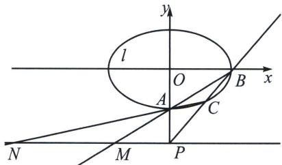

<!-- question-source:start -->
例2（2021·北京）已知椭圆 $E: \frac{x^2}{a^2} + \frac{y^2}{b^2} = 1 (a > b > 0)$ 的一个顶点 $A(0, -2)$ ，以椭圆 $E$ 的四个顶点围成的四边形面积为 $4\sqrt{5}$ .

(1)求椭圆 E 的方程;

(2)过点 $P(0, -3)$ 作斜率为 $k$ 的直线与椭圆 $E$ 交于不同的两点 $B, C$ , 直线 $AB$ 、 $AC$ 分别与直线 $y = -3$ 交于点 $M, N$ , 当 $|PM| + |PN| \leqslant 15$ 时, 求 $k$ 的取值范围.

(1) $\frac{x^2}{5} + \frac{y^2}{4} = 1$

(2)将椭圆按照向量 $\overrightarrow{AO}$ ：(0，2)平移，得 $\frac{x^2}{5} +\frac{(y - 2)^2}{4} = 1$ ，即 $\frac{x^2}{5} +\frac{y^2}{4} -y = 0$ ，此时 $B\to B^{\prime}$ ， $C\to C^{\prime}$ ， $B^{\prime}$

$C^{\prime}$ 过定点 $P^{\prime}(0, - 1)$ ，所以 $B^{\prime}C^{\prime}:mx - y = 1$ ，联立 $\frac{x^2}{5} +\frac{y^2}{4} -y(mx - y) = 0$ ，由于 $x\neq 0$ ，同除以 $x^{2}$ 得： $\frac{5}{4}$ $\frac{y^2}{x^2} -m\frac{y}{x} +\frac{1}{5} = 0,k_{AC}\cdot k_{AB} = \frac{4}{25}$ ，由于AM： $y = k_{1}x - 2$ ，AN： $y = k_2x - 2$ ，当 $y = -3$ ， $x_{M} = \frac{-1}{k_{1}}$ ， $x_{N} =$ $\frac{-1}{k_2},|x_M| + |x_N| = \left|\frac{1}{k_1} +\frac{1}{k_2}\right| = \frac{k_1 + k_2}{k_1k_2} = \frac{25}{4}|k_1 + k_2|\leqslant 15$ ，所以 $|k_1 + k_2| = \left|\frac{4}{5} m\right|\leqslant \frac{12}{5}$ ，所以 $|k_{BC}| =$ $|m|\leqslant 3$ ，当 $B,C$ 重合时， $|k_{BC}| = 1$ ，所以 $k_{BC}\in [-3, - 1)\cup (1,3]$
<!-- question-source:end -->

![[高中/总复习/专题/2026版高中《mst老唐说题》圆锥曲线专题（数学）/上册/第07章_圆锥曲线常规数据处理方法/第二节_隐藏的斜率和积问题/一_同轴轴点弦_顶点角隐藏的斜率之积/例题/answers/Q00048636A1.md]]
