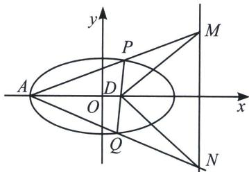

<!-- question-source:start -->
例①（武汉市2021届高中毕业生三月质量检测）已知椭圆 $C: \frac{x^{2}}{a^{2}} + \frac{y^{2}}{b^{2}} = 1 (a > b > 0)$ 的左右顶点分别为 $A, B$ , 过椭圆内点 $D\left(\frac{2}{3}, 0\right)$ 且不与 $x$ 轴重合的动直线交椭圆 $C$ 于 $P$ , $Q$ 两点, 当直线 $PQ$ 与 $x$ 轴垂直时, 239 老唐说题

$|PD|=|BD|=\frac{4}{3}.$

(1)求椭圆 C 的标准方程;

(2)设直线 $AP$ ， $AQ$ 和直线 $l: x = t$ 分别交于点 $M$ ， $N$ ，若 $MD \perp ND$ 恒成立，求 $t$ 的值.

(1)由 $|BD| = \frac{4}{3}$ , 得 $a = \frac{2}{3} + \frac{4}{3} = 2$ , 故 $C$ 的方程为 $\frac{x^2}{4} + \frac{y^2}{b^2} = 1$ , 此时 $P\left(\frac{2}{3}, \frac{4}{3}\right)$ . 代入方程 $\frac{1}{9} + \frac{16}{9b^2} = 1$ , 解得 $b^2 = 2$ , 故 $C$ 的标准方程为 $\frac{x^2}{4} + \frac{y^2}{2} = 1$ .

(2)将椭圆 C 按照向量 $\overrightarrow{AO}=(2,0)$ 平移，平移后的 $C':\frac{(x-2)^{2}}{4}+\frac{y^{2}}{2}=1$ ，即 $x^{2}+2y^{2}-4x=0①$ ，设平移后的直线 $P'Q'$ 方程为 $mx+ny=1$ ，恒过 $D'\left(\frac{8}{3},0\right)$ ，则 $\frac{8}{3}m=1$ ，所以 $m=\frac{3}{8}$ ，所以 $\frac{3}{8}x+ny=1$ ，代入①得 $x^{2}+2y^{2}-4x\left(\frac{3}{8}x+ny\right)=0$ ，即 $2y^{2}-4nxy-\frac{1}{2}x^{2}=0$ ，当 $x\neq0$ 时，除以 $x^{2},2\left(\frac{y}{x}\right)^{2}-4n\cdot\frac{y}{x}-\frac{1}{2}=0$ ，因为 $P'$ ， $Q'$ 满足该方程。所以 $k_{OP'}$ ， $k_{OQ'}$ 是关于 $\frac{y}{x}$ 的方程的两个根所以 $k_{OP'}\cdot k_{OQ'}=-\frac{1}{4}$ ，设平移后的 M，N 坐标分别为 $M'(t',m)$ ， $N'(t',n)$ ， $k_{OM'}\cdot k_{ON'}=\frac{m}{t'}\cdot\frac{n}{t'}=\frac{mn}{t'^{2}}=-\frac{1}{4}$ ，所以 $mn=-\frac{1}{4}t'^{2}②$ ，及 $D'M'\perp D'N'$ ，由射影定理 $-mn=\left(t'-\frac{8}{3}\right)^{2}③$ 由②，③， $\frac{1}{4}t'^{2}=\left(t'-\frac{8}{3}\right)^{2}$ ，所以 $\frac{1}{2}t'=t'-\frac{8}{3}$ 或者 $-\frac{1}{2}t'=t'-\frac{8}{3}$ ，所以 $t'=\frac{16}{3}$ 或 $t'=\frac{16}{9}$ ，所以 $t=\frac{10}{3}$ 或 $t=-\frac{2}{9}$ 。
<!-- question-source:end -->

![[高中/总复习/专题/2026版高中《mst老唐说题》圆锥曲线专题（数学）/上册/第07章_圆锥曲线常规数据处理方法/第二节_隐藏的斜率和积问题/一_同轴轴点弦_顶点角隐藏的斜率之积/例题/answers/Q00048961A1.md]]
