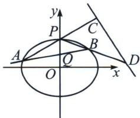

<!-- question-source:start -->
例3 (2022 浙江卷)如图, 已知椭圆 $E: \frac{x^{2}}{12} + y^{2} = 1$ . 设 $A, B$ 是椭圆上异于 $P(0, 1)$ 的两点, 且点 $Q$ $(0, \frac{1}{2})$ 在线段 $AB$ 上, 直线 $PA, PB$ 分别交直线 $y = -\frac{1}{2} x + 3$ 于 $C, D$ 两点.

(1)求点 P 到椭圆上点的距离的最大值;

(2) 求 $\left| CD \right|$ 的最小值.

$$
\text { 解析 } \quad (1) d = \sqrt {x ^ {2} + (y - 1) ^ {2}} \Rightarrow d = \sqrt {1 2 - 1 2 y ^ {2} + y ^ {2} - 2 y + 1} \Rightarrow d = \sqrt {- 1 1 y ^ {2} - 2 y + 1 3} \Rightarrow d \leqslant \frac {1 2 \sqrt {1 1}}{1 1}
$$

(2)由于点 $Q\left(0, \frac{1}{2}\right)$ 在线段 $AB$ 上，我们令 $PA$ 的斜率为 $k_{1}$ ， $PB$ 的斜率为 $k_{2}$ ， $k_{1}k_{2}$ 一定为定值， $k_{1}+k_{2}$ 则是一个变量，本题就是通过处理 $k_{1}+k_{2}$ 这个隐藏的变量来得到最终的结果。将椭圆 $E: \frac{x^{2}}{12}+y^{2}=1$ 按照向量 $\overrightarrow{PO}: (0,-1)$ 平移，则得到方程 $\frac{x^{2}}{12}+(y+1)^{2}=1 \Rightarrow \frac{x^{2}}{12}+y^{2}+2y=0$ ，平移后 $P \to O'$ ， $A \to A'$ ， $B \to B'$ ， $D \to D'$ ， $Q \to Q'$ 易知 $C'D'$ 方程为： $y=-\frac{1}{2}x+2$ ，设 $A'B'$ 方程为 $mx+ny=1$ ，由于点 $Q\left(0, \frac{1}{2}\right)$ 在线段 $AB$ 上，故 $Q'\left(0, -\frac{1}{2}\right)$ ，所以 $n=-2$ ，即 $\frac{x^{2}}{12}+y^{2}+2y=\frac{x^{2}}{12}+y^{2}+2y(mx-2y)=0$ （构造齐次式），同除以 $x^{2}$ 得， $-3\frac{y^{2}}{x^{2}}+2m\frac{y}{x}+\frac{1}{12}=0$ ，所以 $k_{1}, k_{2}$ 是这个关于 $\frac{y}{x}$ 的方程的两个根。

所以 $k_{1} + k_{2} = \frac{2m}{3}, k_{1}k_{2} = -\frac{1}{36}, \left\{ \begin{array}{l} l_{CC'}: y = k_1x \\ l_{C'D'}: y = -\frac{1}{2}x + 2 \end{array} \Rightarrow x_{C'} = \frac{2}{k_1 + \frac{1}{2}} \right.$ 同理： $x_{D'} = \frac{2}{k_2 + \frac{1}{2}}$
<!-- question-source:end -->

![[高中/总复习/专题/2026版高中《mst老唐说题》圆锥曲线专题（数学）/上册/第07章_圆锥曲线常规数据处理方法/第二节_隐藏的斜率和积问题/一_同轴轴点弦_顶点角隐藏的斜率之积/例题/answers/Q00053043A1.md]]
