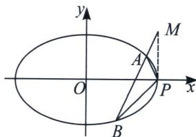
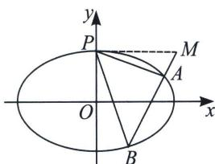

## 三、高考题中隐藏的斜率和与积关系

高考中出现斜率和积问题，最早可以追溯到近二十年前，考题的日新月异决定了不会永远局限于斜率和与积的问题，所以需要通过题目给到的定点或者探索定点的过程中，找到北后的本质逻辑。2022年新课标一卷的斜率和积成为了第一问就能看出来，压轴问往往要根据已知的定点或者定值来探索斜率的关系。

1. 已知点 $P(a, 0)$ 是椭圆 $C: \frac{x^2}{a^2} + \frac{y^2}{b^2} = 1 (a > b > 0)$ 右顶点，

①椭圆上弦 AB 过定点 $(a, t)$ ，则 $k_{PA} + k_{PB} = -\frac{2b^{2}}{at} =$ 定值；

②椭圆上弦 AB 过定点 $(a+t,0)$ ，则 $k_{PA}k_{PB}=\frac{b^{2}(t+2a)}{a^{2}t}=$ 定值；

证明：将椭圆 C 按向量 $\overrightarrow{PO}(-a,0)$ 平移得椭圆 $C':\frac{(x+a)^{2}}{a^{2}}+\frac{y^{2}}{b^{2}}=1\Leftrightarrow\frac{x^{2}}{a^{2}}+\frac{y^{2}}{b^{2}}+\frac{2a}{a^{2}}x=0$

①动点 $A, B$ 分别对应椭圆 $C'$ 上的动点 $A', B'$ ，根据题意直线 $A'B'$ 过定点 $(0, t)$ ， $A'B'$ 的方程为 $mx + \frac{y}{t} = 1$ ，即 $\frac{x^2}{a^2} + \frac{y^2}{b^2} + \frac{2a}{a^2}x (mx + \frac{y}{t}) = 0$ ，当 $x \neq 0$ 时，两边除以 $x^2$ 得： $\frac{1}{b^2}\frac{y^2}{x^2} + \frac{2}{at}\frac{y}{x} + \frac{1 + 2am}{a^2} = 0$ ， $k_{PA} + k_{PB} = -\frac{2b^2}{at}$ 定值；

②动点 $A'$ ， $B'$ 分别对应椭圆 $C'$ 上的动点 $A'$ ， $B'$ ，根据题意直线 $A'B'$ 过定点 $(t, 0)$ ， $A'B'$ 的方程为 $\frac{x}{t} + ny = 1$ ，代入①得 $\frac{x^2}{a^2} + \frac{y^2}{b^2} + \frac{2a}{a^2}x\left(\frac{x}{t} + ny\right) = 0$ ，当 $x \neq 0$ 时，两边除以 $x^2$ 得： $\frac{1}{b^2}\frac{y^2}{x^2} + \frac{2ny}{ax} + \frac{1}{a^2} + \frac{2}{at} = 0$ ， $k_{PA}k_{PB} = \frac{b^2(t + 2a)}{a^2t} =$ 定值；

2. 已知点 $P(0, b)$ 是椭圆 $C: \frac{x^2}{a^2} + \frac{y^2}{b^2} = 1 (a > b > 0)$ 上顶点，

①椭圆上弦 AB 过定点 $(t, b)$ ，则 $\frac{1}{k_{PA}} + \frac{1}{k_{PB}} = -\frac{2a^{2}}{bt} =$ 定值；

②椭圆上弦 AB 过定点 $(0, b+t)$ ，则 $k_{PA}k_{PB}=-\frac{2b^{2}}{at}=$ 定值；

证明：将椭圆 C 按向量 $\overrightarrow{PO}(0, -b)$ 平移得椭圆 $C' : \frac{x^{2}}{a^{2}} + \frac{(y+b)^{2}}{b^{2}} = 1 \Leftrightarrow \frac{x^{2}}{a^{2}} + \frac{y^{2}}{b^{2}} + \frac{2b}{b^{2}} y = 0$ ,

①动点 $A'$ ， $B'$ 分别对应椭圆 $C'$ 上的动点 $A'$ ， $B'$ ，根据题意直线 $A'$ ， $B'$ 过定点 $(t, 0)$ ， $A'$ ， $B'$ 的方程为 $\frac{x}{t} + ny = 1$ ，即，当 $x \neq 0$ 时，两边除 $\frac{x^2}{a^2} + \frac{y^2}{b^2} + \frac{2b}{b^2} y\left(\frac{x}{t} + ny\right) = 0$ 以 $x^2$ 得： $\frac{1 + 2bn y^2}{b^2} + \frac{2}{bt} \frac{y}{x} + \frac{1}{a^2} = 0$ ， $\frac{1}{k_{PA}} + \frac{1}{k_{PB}} = -\frac{2a^2}{bt}$ 定值；

②动点 $A'$ ， $B'$ 分别对应椭圆 $C'$ 上的动点 $A'$ ， $B'$ ，根据题意直线 $A'$ ， $B'$ 过定点 $(0, t)$ ， $A'$ ， $B'$ 的方程为 $mx + \frac{y}{t} = 1$ ，即 $\frac{x^2}{a^2} + \frac{y^2}{b^2} + \frac{2b}{b^2} y (mx + \frac{y}{t}) = 0$ ，当 $x \neq 0$ 时，两边除以 $x^2$ 得： $\left(\frac{1}{b^2} + \frac{2}{bt}\right) \frac{y^2}{x^2} + \frac{2m}{b} \frac{y}{x} + \frac{1}{a^2} = 0$ ， $k_{PA} k_{PB} = \frac{b^2 t}{a^2 (t + 2b)} =$ 定值；

我们不需要记忆这个定值，但是我们可以提前预判定值的类型，从而进行定点定值的必要性探路，

(1)当角的顶点 P 为椭圆的 x 轴顶点时，第三边直线过了 x 轴定点，那么斜率之积 $k_{PA}k_{PB}$ 为定值，当第三边直线过了 y 轴定点时，那么斜率之和 $k_{PA} + k_{PB}$ 为定值；

(2)当角的顶点 $P$ 为椭圆的 $y$ 轴顶点时, 第三边直线过了 $x$ 轴定点, 那么斜率倒数和 $\frac{1}{k_{PA}} + \frac{1}{k_{PB}}$ 为定值, 当第三边直线过了 $y$ 轴定点时, 那么斜率之积 $k_{PA} k_{PB}$ 为定值;

最终得到一句口诀：同积异和！即轴点弦和角顶点在相同轴上，斜率积为定值，轴点弦和角顶点在不同

轴上，斜率和或者倒数和为定值.
