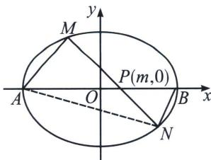

## 二、隐藏的斜率之比

若 A、B 为椭圆长轴顶点，直线 MN 交椭圆于 M、N 两点，交长轴于点 $P(m,0)$ ，则 $\frac{k_{AM}}{k_{BN}}$ 为定值，反之， $\frac{k_{AM}}{k_{BN}}$ 为定值，则 MN 过长轴上定点 $P(m,0)$ ;

![[高中/总复习/专题/2026版高中《mst老唐说题》圆锥曲线专题（数学）/上册/第07章_圆锥曲线常规数据处理方法/第二节_隐藏的斜率和积问题/二_隐藏的斜率之比/例题/Q00053044.md]]
![[高中/总复习/专题/2026版高中《mst老唐说题》圆锥曲线专题（数学）/上册/第07章_圆锥曲线常规数据处理方法/第二节_隐藏的斜率和积问题/二_隐藏的斜率之比/例题/Q00053045.md]]
